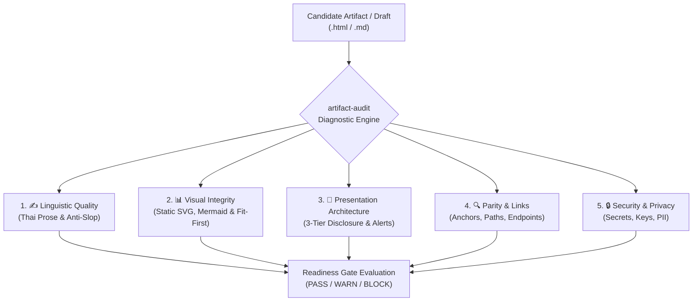

# Artifact Pre-Flight & Quality Audit Suite (`artifact-audit`)

The `artifact-audit` skill is an automated quality, security, and integrity gatekeeper for HTML and Markdown artifacts.
It inspects candidate documents **before** they are published via `artifact_sftp.publish` or during repository maintenance with `artifact-groom`.

By unifying the checks of the DocCraft specialized suite (`thai-prose-craft`, `artifact-curator`, `visual-illustrator`, `doc-synchronizer`) alongside strict security and link hygiene rules, `artifact-audit` ensures every published artifact is executive-ready, syntax-safe, privacy-compliant, and professional.

---

## 1. Mandatory Routing & Invariants

1. **Mandatory Hard Gate (CANNOT BYPASS):** Always run `artifact-audit` before calling `artifact_sftp.publish` on non-trivial documents and during Stage 2 & Stage 5 of `artifact-groom`. Skipping or bypassing this gate is strictly forbidden.
2. **Local-First & Non-Destructive:** `artifact-audit` is a read-only diagnostic evaluator. It does not overwrite files without user direction or publish behind the user's back.
3. **Hard Blocker Gate:** If any **Critical Blockers** (e.g. hardcoded secrets, broken Mermaid syntax, or path traversal links) are detected (🔴 **BLOCK**), publication MUST be halted immediately until remediated.
4. **Remediation Routing:** When deficiencies are detected, route immediately to the appropriate specialized skill (`thai-prose-craft`, `visual-illustrator`, `artifact-curator`, `doc-synchronizer`) to perform targeted repairs.

---

## 2. The 5-Dimension Quality & Security Audit Matrix



---

### Dimension 1: ✍️ Linguistic Quality & Anti-Slop Audit

*Powered by `thai-prose-craft` standards.*

- **Anti-AI Slop Dictionary:** Scans for banned robotic translation clichés:
  - ❌ *"ในยุคดิจิทัลปัจจุบัน"*, *"ถือเป็นสิ่งสำคัญอย่างยิ่ง"*, *"กุญแจสำคัญสู่ความสำเร็จ"*
  - ❌ *"เพื่อเพิ่มประสิทธิภาพและประสิทธิผล"*, *"ด้วยความมุ่งมั่นที่จะพัฒนา"*
- **Active vs. Passive Bloat:** Flags repetitive passive constructions (e.g. *"ได้ถูกดำเนินการจัดทำขึ้นโดย"*) and replaces with active, direct verbs (*"ทีมงานจัดทำ..."*).
- **Thai Typography & Line-Height Gate (🔴 BLOCK / 🟡 WARN):**
  - Evaluates CSS `line-height` on Thai text containers (`body`, `p`, `li`, `td`, `.card`, `.callout`).
  - 🔴 **BLOCK:** If `line-height < 1.3` on Thai prose, causing direct vertical collision where lower vowels (`ุ, ู`) clash into upper vowels/tone marks (`ิ, ี, ่, ้`) of the next line.
  - 🟡 **WARN:** If `line-height < 1.5` (standard requires $\ge 1.5$, recommended `1.6`–`1.7` for readability).
- **Tone & Register Alignment:** Verifies tone matches the document's intended audience:
  - **Executive / Board**: Punchy executive summaries, bottom-line upfront, zero conversational filler.
  - **Technical Spec / RFC**: Unambiguous invariants, precise terminology, RFC 2119 keywords (`MUST`, `SHOULD`).
  - **User Guide**: Clear step-by-step imperatives.

---

### Dimension 2: 📊 Visual & Diagrammatic Integrity Audit

*Powered by `visual-illustrator` standards.*

This dimension enforces the accepted **Option 4 (Static Sanitized Inline SVG
Delivery)** contract for published HTML while preserving Mermaid validation for
inline chat and pure Markdown.

- **Zero-Fail Mermaid Quoting Rule:** 
  - Checks that every node label containing special characters (`()`, `[]`, `{}`, `:`, `/`, `-`) is strictly wrapped in double quotes: `node["Label (Details): Info"]`.
- **Diagram Syntax & Archetype Validation:**
  - Verifies chart type keywords are exact: `flowchart TD/LR`, `sequenceDiagram`, `erDiagram`, `stateDiagram-v2`, `gitGraph`, `mindmap`.
  - Ensures sequence diagrams use valid message arrows (`->>`, `-->>`, `-x`).
  - Ensures subgraphs are properly paired with `end` statements and not nested deeper than 2 levels.
- **Enterprise Palette Conformance:**
  - Flags default unstyled neon colors; validates presence of standardized pastel `classDef` tokens (`primary`, `service`, `gateway`, `storage`, `queue`, `danger`, `external`).
- **Raw Mermaid in HTML Check (🔴 BLOCK):** If the candidate is `.html` and contains `<pre class="mermaid">` or a raw ```` ```mermaid ```` fence without a static rendered SVG representation, **BLOCK**. Mermaid remains valid for inline chat and pure Markdown when its syntax is safe.
- **Horizontal Scroll Check (🔴 BLOCK):** If a diagram card enforces `overflow-x: scroll` or `overflow-x: auto` on the primary overview, **BLOCK**. Detail-only pan or scroll inside a bounded Viewport Lightbox is allowed.
- **SVG Security & ID Hygiene Check (🔴 BLOCK):** If inline SVG contains `<script>`, `<foreignObject>`, `on*` event handlers, `javascript:` URLs, external URLs/assets, external `url()`, or colliding/unnamespaced IDs, **BLOCK**. Reusable resources must use unique per-diagram IDs such as `id="diag1-..."`.
- **Diagram Collision & Overlap Check (🔴 BLOCK):**
  - **Unbadged Edge Labels:** If text labels along connection paths are not backed by a background `<rect>` badge and hover bare over lines, **BLOCK**.
  - **Node Bounding Box Intersection:** If diagram nodes overlap each other without clearance ($\text{gap} < 40\text{px}$), **BLOCK**.
  - **Collinear Path Collisions:** If multiple connection lines share identical coordinates or slice through node centers, **BLOCK**.
  - **Thai Multiline Text Step in SVG (`<tspan dy="...">`):** If multiline SVG text containing Thai characters sets vertical step $\text{dy} < 1.3 \times \text{font-size}$ (causing upper tone marks and lower vowels to collide between lines), **BLOCK**. If $1.3 \le \text{dy} < 1.5 \times \text{font-size}$, **WARN**.
- **Complex Diagram Lightbox Check (🟡 WARN):** If a diagram is complex (more than 12 nodes) and lacks an Expand Detail / Viewport Lightbox trigger, **WARN** and route it for remediation.
- **Fit-First & Accessible Lightbox Standard (🟢 PASS):** The overview is 100% responsive fit, readable, free of visual collisions, and provides an accessible native `<dialog>` lightbox for detail inspection when supported. No-JavaScript fallback remains a sanitized static fit.
- **Responsive Layout:** Verifies primary diagram cards use `max-width: 100%` and `overflow: hidden`. Tables may use a bounded responsive wrapper when necessary, but table behavior must never turn the primary diagram overview into a horizontal scroll surface.

---

### Dimension 3: 📑 Structural & Presentation Architecture Audit

*Powered by `artifact-curator` standards.*

- **3-Tier Progressive Disclosure:**
  - **Tier 1 (Executive Summary):** 3-5 bullet points + key metrics at the top.
  - **Tier 2 (Core Architecture & Walkthrough):** Visual diagrams, decision flows, core tables.
  - **Tier 3 (Deep-Dive Appendix):** Complete schemas, logs, edge-case tables.
- **GitHub Alert Standard:**
  - Verifies alert callouts use official syntax (`> [!NOTE]`, `> [!TIP]`, `> [!IMPORTANT]`, `> [!WARNING]`, `> [!CAUTION]`).
  - Flags and rejects consecutive or nested callout blocks.
- **Comparative Data Density:**
  - Checks that multi-variable data is rendered as structured Markdown comparison tables rather than long unstructured lists.
- **File & Code Symbol Links:**
  - Enforces valid clickable link syntax: `[utils.py](file:///path/to/utils.py)` (never `[utils.py](`file:///...`)`).

---

### Dimension 4: 🔍 Code-to-Docs Parity & Agent Plugins 1.0.0 Conformance Audit

*Powered by `doc-synchronizer` standards.*

- **Agent Plugins 1.0.0 Conformance Gate (🔴 BLOCK):**
  - **Manifest Schema:** Validates `plugin.json` against `https://agent-plugins.org/schemas/1.0.0/plugin.schema.json`.
  - **MCP Schema:** Validates `mcp.json` against `https://agent-plugins.org/schemas/1.0.0/mcp.schema.json`.
  - **Skill Frontmatter:** Ensures all skills in `skills/**/SKILL.md` have valid YAML frontmatter (`name` $\le 64$ chars matching directory, `description` $\le 1024$ chars, allowed standard fields).
  - **MCP-Only Agent Routing:** Confirms `AGENTS.md` and skills mandate `artifact_sftp.*` MCP tools and never leak internal script names (`publish.sh`, `setup.sh`, etc.).
  - **Automated Conformance Suite:** Executes `tests/test_agent_plugins.py` (or `pytest tests/test_agent_plugins.py`) to verify zero conformance drift.
- **Broken Link & Anchor Verification:**
  - Scans all relative links (`./docs/guide.html`) and internal anchor hashes (`#section-3`) to confirm targets exist.
  - Verifies remote URLs are well-formed without trailing typos or bad query strings.
- **Code & API Parity:**
  - Matches documented CLI commands, tool names (`artifact_sftp.*`), and function signatures against current codebase files.
- **Asset Integrity:**
  - Confirms referenced images, diagrams, or stylesheets exist and are accessible.

---

### Dimension 5: 🔒 Security & Privacy Hygiene Audit

- **Secret & Token Scan (Hard Blocker):**
  - Detects accidental inclusion of PEM private keys, 1Password vault references, cloud provider access keys, bearer tokens, and raw API passwords.
- **Sensitive PII & Internal Network Leaks:**
  - Flags unmasked production credentials, internal staging IP addresses, or customer PII.
- **Publisher Script Bypasses:**
  - Ensures artifact does not wrap, invoke, or leak internal script files directly.

---

## 3. Audit Scoring & Readiness Verdict

After completing the 5-dimension scan, `artifact-audit` generates a structured scorecard and verdict:

```text
================================================================================
📋 ARTIFACT PRE-FLIGHT AUDIT REPORT
Target: docs/reports/system-architecture.html (Candidate for: codex/private/system-arch)
================================================================================
[1] ✍️ Linguistic Quality (Thai Prose):       🟡 WARN (2 robot translation clichés found)
[2] 📊 Visual & Diagrammatic Integrity:      🟢 PASS (Static SVG fit-first, safe IDs, Mermaid rules)
[3] 📑 Presentation & Layout:                🟢 PASS (3-tier structure, valid [!IMPORTANT] alert)
[4] 🔍 Parity & Plugin Conformance:        🟢 PASS (Agent Plugins 1.0.0 verified, anchors valid)
[5] 🔒 Security & Privacy Hygiene:           🟢 PASS (Zero secrets / clean environment)
--------------------------------------------------------------------------------
VERDICT: 🟡 READY WITH WARNINGS (Recommended to clean prose before publish)
================================================================================
```

### Verdict Rules:

| Verdict | Status | Policy | Agent Action |
|:---:|:---:|---|---|
| 🟢 **PASS** | 100% Clean | All 5 dimensions pass; Agent Plugins 1.0.0 conformant; HTML rich diagrams are static sanitized inline SVG, fit-first, and have accessible detail support when needed | Proceed immediately to `artifact_sftp.publish` or complete groom |
| 🟡 **WARN** | Minor Issues | Non-breaking quality warnings, including a complex diagram over 12 nodes without an Expand Detail / Viewport Lightbox trigger | Show every warning, then follow the visibility approval policy or remediate and re-audit |
| 🔴 **BLOCK** | Critical Flaws | Secret/dead link, Agent Plugins 1.0.0 non-conformance (invalid schema, frontmatter violations, leaked internal scripts), raw Mermaid in HTML without static SVG, primary overview horizontal scroll, unsafe SVG content, colliding/unnamespaced IDs, or unbadged text collisions and overlapping paths | **HALT PUBLISH.** Route to remediation and re-audit before upload |

---

## 4. Remediation Routing Guide

When an audit surfaces issues, route the artifact to the specialized skill for automatic repair:

| Detected Issue in Audit | Remediation Skill | Trigger Action |
|---|---|---|
| Robot clichés, passive verb bloat, unnatural Thai | `thai-prose-craft` | Run Anti-Slop rewrite on identified paragraphs |
| Broken Mermaid syntax, unquoted labels, missing chart | `visual-illustrator` | Wrap labels in `""`, inject diagram or classDef tokens |
| Raw Mermaid in HTML without a static rendered SVG | `visual-illustrator` | Replace the HTML Mermaid block with sanitized semantic inline SVG; keep Mermaid only for chat/Markdown |
| Primary diagram overview uses `overflow-x: scroll` or `overflow-x: auto` | `visual-illustrator` | Apply the 100% fit-first container (`max-width: 100%`, `overflow: hidden`) and move detail navigation into the lightbox |
| Unsafe SVG element/attribute, external URL, or colliding ID | `visual-illustrator` | Remove executable/external content and regenerate namespaced IDs such as `diag1-...` |
| Complex diagram lacks an Expand Detail / Viewport Lightbox trigger | `visual-illustrator` | Add the accessible native `<dialog>` component or document the intentional low-complexity exception |
| Wall-of-text, missing summary, unformatted tables | `artifact-curator` | Refactor into 3-tier layout, insert GitHub alerts & tables |
| Dead links, outdated CLI flags, version mismatch | `doc-synchronizer` | Fix anchors and synchronize with current repository state |
| Hardcoded secrets, private keys | *Self-Remediation* | Strip secret string immediately, replace with env placeholder |

---

## 5. Seamless Workflow Integration

### Integration with `artifact-sftp` (Pre-Publish Guard)
Before executing `artifact_sftp.publish`, run `artifact-audit` on the source file. If verdict is 🔴 **BLOCK**, stop and explain the exact issue to the user.

### Integration with `artifact-groom` (Full Lifecycle Modernization)
During grooming:
1. `artifact_sftp.list` discovers existing artifacts and drafts.
2. `artifact-audit` diagnoses all candidates and populates the Grooming Report with concrete quality scores.
3. User selects candidates -> Specialized skills refactor source -> `artifact-audit` re-verifies (Verifying 🟢 PASS).
4. `artifact_sftp.publish` uploads the verified, modernized version.
