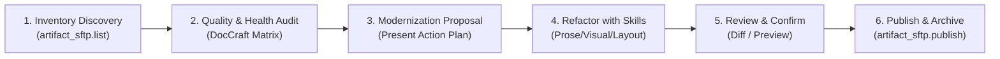

# Artifact Grooming & Modernization Suite (Local-First)

The `artifact-groom` skill is an MCP-only workflow that audits, inspects, modernizes, and curates HTML and Markdown artifacts in a project.
It discovers the local custody record (`docs/artifacts/`) and workspace HTML files through `artifact_sftp.list`,
diagnoses artifact quality using the specialized DocCraft suite (`thai-prose-craft`, `artifact-curator`, `visual-illustrator`, `doc-synchronizer`),
refactors candidate sources, and seamlessly publishes upgraded versioned snapshots via `artifact_sftp.publish`.

## Mandatory Routing & Invariants

1. **MCP-only routing:** Use only `artifact_sftp.*` MCP tools (`artifact_sftp.list`, `artifact_sftp.publish`, `artifact_sftp.unpublish`, `artifact_sftp.read`).
2. **Local-First Invariant:** Always begin by discovering local custody in `docs/artifacts/` and workspace drafts with `artifact_sftp.list`.
3. **Mandatory Audit Hard Gate (`artifact-audit` — CANNOT BYPASS):** The AI agent **MUST** execute Stage 2 (`artifact-audit`) and render the 5-dimension quality matrix for discovered artifacts before presenting modernization proposals. Publishing upgraded versions strictly requires a 🟢 **PASS** (or 🟡 **WARN**) pre-flight gate clearance in Stage 5.
4. **Workspace Source Custody:** Apply modernizations to local workspace source documents before publishing so project version control (Git) retains full change provenance.
5. **Interactive Consent:** Never publish updates or destructive unpublishes without explicit user review and confirmation.
   - For `private` visibility updates/unpublishes: requires `confirm=true`.
   - For `public` visibility updates/unpublishes: requires BOTH `confirm=true` and `confirm_public=true`.
6. **No Redundant Verification:** `artifact_sftp.publish` executes internal hash matching, SFTP verification, and privacy probing automatically. Do NOT execute follow-up `artifact_sftp.read` or browser fetch calls after publishing.

---

## 6-Stage Grooming & Modernization Workflow



---

### Stage 1: Inventory Discovery via MCP

Call `artifact_sftp.list` with `project_path` (optional `tool`, `visibility`, and `limit`):

```json
{
  "project_path": "/path/to/project",
  "limit": 100
}
```

- Inspects all tool namespaces (`codex`, `openclaw`, `claude`) and visibilities (`private`, `public`) in `docs/artifacts/`.
- Retrieves each artifact's `latest_version`, `latest_snapshot`, `snapshot_count`, `mtime`, and `index_sha256`.
- Discovers `local_drafts` with structured metadata (`path`, `mtime`, `size`, `sha256`), automatically pruning build/cache trees (`dist/`, `build/`, `coverage/`, `.next/`).

---

### Stage 2: Quality & Health Diagnosis (via `artifact-audit`)

Run `artifact-audit` on discovered artifacts and local drafts to evaluate both **Freshness Health** and **Multi-Dimensional Quality**:

#### 1. Freshness Health Matrix

| Status | Icon | Criteria | Primary Action |
|---|:---:|---|---|
| **Fresh / Synced** | 🟢 | Normalized source matches latest snapshot | Evaluate for Modernization |
| **Stale / Outdated** | 🟡 | Source HTML has newer edits or different normalized content | Modernize & Publish new version |
| **Unlinked Source** | ⚪ | Source filename differs from slug; provenance unconfirmed | Prompt user for source path |
| **Orphaned / Ephemeral**| 🔴 | Source deleted or slug matches test prefixes (`test-*`, `tmp-*`) | Propose `artifact_sftp.unpublish` |
| **Local Draft** | 📝 | Workspace HTML exists without published archive | Modernize & Initial Publish |

#### 2. Specialized Skill Diagnostic Checklist

`artifact-audit` checks whether the artifact requires invocation of specialized skills:

| Diagnostic Focus | Specialized Skill | Target Improvements |
|---|---|---|
| **✍️ Thai Prose & Anti-Slop** | `thai-prose-craft` | • Eliminate AI translation clichés ("ในยุคปัจจุบัน", "ถือเป็นสิ่งสำคัญ")<br>• Convert passive/bloated verbs to crisp active phrasing<br>• Authentic bilingual terminology alignment |
| **📊 Visual Diagrams** | `visual-illustrator` | • Replace text walls with syntax-safe Mermaid architecture/flowcharts<br>• Enforce double-quoted labels `node["Text"]` to prevent render crash<br>• Apply enterprise palette standard (`classDef` styles) |
| **📑 Executive Layout & Alerts** | `artifact-curator` | • Restructure into 3-tier progressive disclosure (Summary -> Deep-dive -> Schema)<br>• Insert GitHub alerts (`NOTE`, `TIP`, `IMPORTANT`, `WARNING`, `CAUTION`)<br>• Add comparative evaluation tables and carousels |
| **🔍 Parity & Links** | `doc-synchronizer` | • Audit code-to-docs parameter names, endpoints, and version tags<br>• Verify internal anchors and external reference links |

---

### Stage 3: Present Actionable Grooming Report

Render a comprehensive summary table to the user:

```text
| Slug / Path | Type / Visibility | Version | Health | Modernization Opportunities | Recommended Action |
|---|---|---|:---:|---|---|
| system-arch | codex / private | v1 | 🟡 Stale | 📊 Add Mermaid microservice flow<br>✍️ Polish Thai executive summary | Modernize & Publish v2 |
| onboarding-guide | openclaw / private | v2 | 🟢 Fresh | 📑 Add Callout alerts & 3-tier structure | Upgrade layout & Publish v3 |
| draft-report.html | (local draft) | - | 📝 Draft | ✍️ Remove AI slop<br>📊 Insert ERD diagram | Modernize & Initial Publish |
| smoke-test-99 | codex / private | v1 | 🔴 Ephemeral | None (temporary test run) | Unpublish & Teardown |
```

---

### Stage 4: Refactor Source with Specialized Skills

When the user selects an artifact to modernize, invoke the corresponding skills to enhance the workspace source file:

1. **Invoke `thai-prose-craft`:**
   - Scan Thai paragraphs for robotic translation patterns.
   - Rewrite sentences into direct, punchy, active Thai appropriate for the chosen register (Executive / Technical / Guide).
2. **Invoke `visual-illustrator`:**
   - Generate robust, syntax-safe Mermaid diagrams with double-quoted node labels.
   - Attach enterprise color classes (`classDef primary`, `classDef storage`, etc.).
3. **Invoke `artifact-curator`:**
   - Organize headings and add executive callouts (`> [!NOTE]`, `> [!IMPORTANT]`).
   - Format dense lists into scannable comparison matrices.
4. **Invoke `doc-synchronizer`:**
   - Re-verify code symbols, config variable names, and file paths.

---

### Stage 5: Pre-Publish Audit (`artifact-audit`) & Confirmation

Run a final verification pass with `artifact-audit` to ensure a 🟢 **PASS** verdict (zero syntax errors, clean prose, no leaked secrets), and present the diff summary to the user before publishing:

```text
Ready to publish modernized version:
• Target: codex / private / system-arch (v1 -> v2)
• Audit Verdict: 🟢 PASS (100% clean)
• Enhancements Applied:
  - Injected Architecture Flowchart (Mermaid) with enterprise palette
  - Polished Thai executive summary (removed 4 AI-slop phrases)
  - Added [!IMPORTANT] security notice callout

Proceed with publish? (y/n)
```

---

### Stage 6: Publish & Archive (`artifact_sftp.publish`)

Once confirmed, execute publication via MCP:

```json
{
  "project_path": "/path/to/project",
  "source_path": "path/to/source.html",
  "slug": "system-arch",
  "tool": "codex",
  "visibility": "private",
  "confirm": true
}
```

*(For public visibility, provide BOTH `confirm: true` and `confirm_public: true`)*.

#### Post-Publish Completion:
- The publisher automatically updates `docs/artifacts/<tool>/<vis>/<slug>/index.html` and creates the new versioned snapshot (e.g. `system-arch--2--<timestamp>.html`).
- Report the published URL, assigned version number, and updated health status to the user.
- **Do not execute redundant read/verify calls.** The publication is complete and verified.

