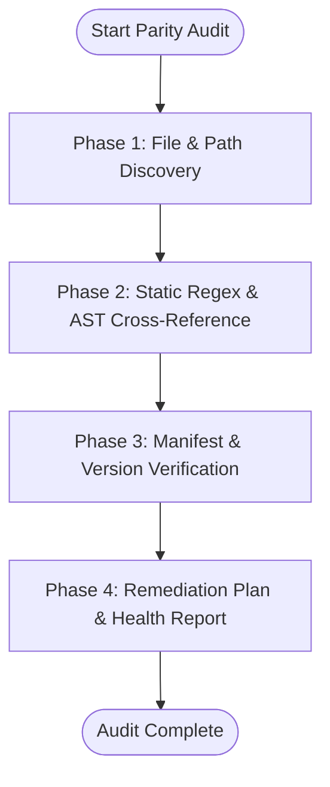

# Doc Synchronizer

Audits and synchronizes project documentation, configuration manifests, skill specifications, and actual codebase implementations to guarantee zero drift, valid links, and version parity across agent plugin ecosystems.

---

## 1. Purpose & Core Mission

Documentation and configuration rot is a primary failure mode in modern software and AI agent workflows. As APIs evolve, parameters change, files get reorganized, and versions bump, documentation quickly drifts out of sync with actual code.

**`doc-synchronizer`** functions as an automated auditor and synchronization engine. It enforces:
- **Lockstep Code-Documentation Synchronization**: Ensures documented function signatures, CLI flags, route endpoints, and file paths reflect actual source implementations.
- **Link & Reference Integrity**: Validates all relative file paths, `file:///` URLs, anchor links, and external endpoints.
- **Multi-Ecosystem Manifest Parity**: Enforces version and configuration alignment across `package.json`, `plugin.json`, `.claude-plugin/`, `.codex-plugin/`, `.agents/`, and marketplace registries.
- **Agent Skill Specification Compliance**: Verifies YAML frontmatter validity, slug naming rules, instruction completeness, and schema adherence according to the `agent-plugins.org (v1.0.0)` standard.

---

## 2. Audit Vectors & Inspection Rules

### Vector 1: Code-Documentation Drift Detection
Inspect markdown documentation against the actual codebase to catch stale references:

1. **Function & Method Signatures**:
   - Verify that documented function names, arguments, return types, and default options exist in source code.
   - Flag deprecated or renamed parameters still referenced in guides and code blocks.
2. **CLI Commands & Flags**:
   - Cross-reference documented CLI usage with parser definitions (e.g. `commander`, `yargs`, `argparse`, `flags`).
   - Catch missing flags, renamed subcommands, and outdated default values.
3. **Route & Endpoint Definitions**:
   - Compare documented REST/GraphQL/RPC endpoints against router files and controller decorators.
   - Validate HTTP methods (GET/POST/PUT/DELETE), URL parameters, and payload schemas.
4. **Code Block & Snippet Parity**:
   - Ensure documented import statements (`import ... from '...'` or `require('...')`) target valid export paths.
   - Detect references to deleted or renamed modules and helper utilities.
5. **Project Structure Trees**:
   - Compare markdown ASCII directory trees against the actual filesystem layout.

### Vector 2: Broken Links & Path Integrity
Verify all forms of internal and external pointers across markdown files:

1. **Relative Markdown Links**:
   - Validate that `[Title](../path/to/file.md)` targets exist on disk relative to the source markdown file.
2. **File URI Scheme Links**:
   - Validate `[Symbol](file:///absolute/path/to/file#L10-L25)` links: ensure target file exists and line numbers fall within file length.
3. **Markdown Heading Anchors**:
   - Check internal anchor links (`[Section](#heading-slug)`) against slugified headers in the target document.
4. **Media & Image Assets**:
   - Verify image references (``) resolve to valid binary files on disk.
5. **External URLs**:
   - Check external hyperlinks for valid URL syntax and protocol schemes (`https://`).

### Vector 3: Version Parity & Manifest Synchronization
Maintain strict version and metadata consistency across all manifest files in the repository:

1. **SemVer Synchronization**:
   - Ensure the version string in `package.json` exactly matches:
     - `plugin.json` (`version`)
     - `.claude-plugin/plugin.json` (`version`)
     - `.codex-plugin/plugin.json` (`version`)
     - `.claude-plugin/marketplace.json` (under `plugins[].version` and `metadata.version`)
     - `.agents/plugins/marketplace.json` (under `plugins[].version`)
     - `CHANGELOG.md` (topmost release header)
2. **MCP Tool Configuration Parity**:
   - Check that tools and commands configured in `.mcp.json` or `mcp.json` point to existing executable scripts or binaries.
   - Verify environment variable names and argument arrays (`args`) match expected companion runtime flags.
3. **Skill Registration Integrity**:
   - Ensure `"skills": "./skills/"` paths in `plugin.json` point to actual skill directories containing valid `SKILL.md` files.

### Vector 4: Skill Spec Completeness (`agent-plugins.org v1.0.0`)
Audit every skill under `skills/*/SKILL.md`:

1. **YAML Frontmatter Rules**:
   - Must start with `---` on line 1 and close with `---`.
   - `name`: Must be lowercase alphanumeric with hyphens (e.g. `doc-synchronizer`), matching its parent directory name.
   - `description`: Must contain a clear summary and explicit trigger conditions explaining when the AI agent should invoke the skill.
2. **Instruction Body Structure**:
   - Must include a clear H1 title, purpose, execution steps, tool call guidelines, and verification rules.
   - Must avoid hardcoded host-specific environment variables without fallback mechanisms.

---

## 3. End-to-End Audit Workflow



### Phase 1: File & Path Discovery
- Scan the repository for all documentation files: `README.md`, `CONTRIBUTING.md`, `docs/**/*.md`, `plugins/**/README.md`.
- Locate all manifests: `package.json`, `**/plugin.json`, `**/.mcp.json`, `**/marketplace.json`.
- Index all skill definition files: `**/skills/*/SKILL.md`.
- Index all codebase source files: `*.js`, `*.mjs`, `*.ts`, `*.py`, `*.go`, `*.sh`.

### Phase 2: Static Regex & AST Cross-Reference
- Extract symbol references, backtick tokens (`` `myFunction()` ``, `` `my-command --flag` ``), and file paths from markdown docs.
- Parse source files using static regex or AST inspection to construct the live symbol table (exported functions, classes, CLI flags, route endpoints).
- Cross-reference extracted documentation tokens against the live symbol table to identify missing, renamed, or signature-drifted symbols.
- Validate all relative markdown link targets and anchor headings against disk.

### Phase 3: Manifest & Version Consistency Check
- Read and parse all JSON manifests.
- Construct the Version Parity Matrix across `package.json`, `plugin.json`, Claude/Codex manifests, and marketplace registries.
- Verify path mappings for `skills`, `mcpServers`, and script entrypoints.

### Phase 4: Remediation Plan & Health Report Generation
- Calculate the aggregate **Documentation Health Score (0–100%)**.
- Triage findings into High, Medium, and Low severity.
- Generate a structured health report artifact (`doc_health_report.md`).
- Formulate automated remediation patches (diffs and CLI commands).

---

## 4. Documentation Health Report Template

When conducting an audit, produce a structured markdown artifact following this template:

```markdown
# Documentation & Codebase Parity Health Report

**Generated**: YYYY-MM-DD HH:MM:SS  
**Auditor**: doc-synchronizer  
**Scope**: [All Plugins / Specific Plugin / Workspace]  
**Health Score**: [ 92 / 100 ] 🟢 PASS (or 🟡 WARN / 🔴 FAIL)

---

## Executive Summary

| Category | High Severity | Medium Severity | Low Severity | Total |
| :--- | :---: | :---: | :---: | :---: |
| Code & API Drift | 0 | 1 | 2 | 3 |
| Broken Links & Paths | 0 | 0 | 1 | 1 |
| Manifest & Version Parity | 0 | 0 | 0 | 0 |
| Skill Spec Compliance | 0 | 0 | 0 | 0 |
| **Total Issues** | **0** | **1** | **3** | **4** |

---

## 1. Code & API Drift Findings

| Location | Reference in Doc | Actual Codebase State | Severity | Recommended Fix |
| :--- | :--- | :--- | :---: | :--- |
| `docs/api.md:42` | `syncDocs(path, dryRun)` | `syncDocs({ targetPath, dryRun, silent })` | 🟡 Medium | Update function call signature to object param |
| `README.md:88` | `--output-format` | `--format` | 🔵 Low | Update CLI flag in usage example |

---

## 2. Broken Links & Path Discrepancies

| Source File | Link / Reference | Target Path | Issue | Recommended Fix |
| :--- | :--- | :--- | :---: | :--- |
| `docs/guide.md:15` | `[Architecture](./arch.md)` | `./arch.md` | File not found | Update to `[Architecture](./architecture.md)` |

---

## 3. Manifest & Version Parity Matrix

| Manifest File | Field | Current Value | Target / Baseline | Status |
| :--- | :--- | :--- | :--- | :---: |
| `package.json` | `version` | `0.2.0` | `0.2.0` | 🟢 Synced |
| `plugins/doc-craft/plugin.json` | `version` | `0.2.0` | `0.2.0` | 🟢 Synced |
| `.claude-plugin/marketplace.json` | `plugins[doc-craft].version` | `0.2.0` | `0.2.0` | 🟢 Synced |
| `.agents/plugins/marketplace.json` | `plugins[doc-craft].version` | `0.2.0` | `0.2.0` | 🟢 Synced |

---

## 4. Skill Specification Compliance

| Skill Directory | SKILL.md Exists | Frontmatter Valid | Slug Match | Trigger Description Quality |
| :--- | :---: | :---: | :---: | :---: |
| `skills/doc-synchronizer` | ✅ Yes | ✅ Valid | ✅ Matches | 🟢 Comprehensive |
| `skills/thai-prose-craft` | ✅ Yes | ✅ Valid | ✅ Matches | 🟢 Comprehensive |

---

## 5. Automated Remediation Action Plan

### Proposed Diffs

```diff
--- a/docs/api.md
+++ b/docs/api.md
@@ -42,1 +42,1 @@
-const result = syncDocs('/path', true);
+const result = syncDocs({ targetPath: '/path', dryRun: true });
```

### Actionable Commands
```bash
# 1. Update version across all manifests simultaneously
node scripts/sync-versions.mjs 0.2.1

# 2. Run automated verification suite
npm test
```
```

---

## 5. Actionable CLI Verification Commands

### A. Manifest Version Parity Check (Node.js)
```bash
node -e '
const fs = require("fs");
const rootPkg = JSON.parse(fs.readFileSync("package.json", "utf8"));
const version = rootPkg.version;
console.log(`Checking version parity against package.json (${version})...`);

const manifests = [
  "plugins/agy/.claude-plugin/plugin.json",
  "plugins/agy/.codex-plugin/plugin.json",
  "plugins/agy/plugin.json",
  "plugins/quota-dashboard/.claude-plugin/plugin.json",
  "plugins/quota-dashboard/.codex-plugin/plugin.json",
  "plugins/quota-dashboard/plugin.json",
  "plugins/doc-craft/.claude-plugin/plugin.json",
  "plugins/doc-craft/.codex-plugin/plugin.json",
  "plugins/doc-craft/plugin.json",
  ".claude-plugin/marketplace.json"
];

let errors = 0;
for (const m of manifests) {
  if (!fs.existsSync(m)) { console.warn(`Missing: ${m}`); continue; }
  const data = JSON.parse(fs.readFileSync(m, "utf8"));
  const mVer = data.version || (data.metadata && data.metadata.version);
  if (mVer && mVer !== version) {
    console.error(`❌ Version mismatch in ${m}: found ${mVer}, expected ${version}`);
    errors++;
  } else {
    console.log(`✅ ${m}: ${mVer || "verified"}`);
  }
}
if (errors > 0) process.exit(1);
console.log("All version manifests are synchronized.");
'
```

### B. Relative Markdown Link & Asset Existence Validator
```bash
node -e '
const fs = require("fs");
const path = require("path");

function walk(dir, fileList = []) {
  const files = fs.readdirSync(dir);
  for (const file of files) {
    if (file === "node_modules" || file === ".git") continue;
    const full = path.join(dir, file);
    if (fs.statSync(full).isDirectory()) walk(full, fileList);
    else if (file.endsWith(".md")) fileList.push(full);
  }
  return fileList;
}

const mdFiles = walk(".");
let broken = 0;
const linkRegex = /\[([^\]]+)\]\((?!http|https|#|mailto:)([^)]+)\)/g;

for (const md of mdFiles) {
  const content = fs.readFileSync(md, "utf8");
  let match;
  while ((match = linkRegex.exec(content)) !== null) {
    const rawTarget = match[2].split("#")[0];
    if (!rawTarget) continue;
    const resolved = rawTarget.startsWith("file://")
      ? rawTarget.replace(/^file:\/\//, "")
      : path.resolve(path.dirname(md), rawTarget);
    if (!fs.existsSync(resolved)) {
      console.error(`❌ Broken link in ${md}: "${match[2]}" -> not found at ${resolved}`);
      broken++;
    }
  }
}
if (broken > 0) { console.error(`Found ${broken} broken links.`); process.exit(1); }
else console.log(`All relative markdown links validated successfully across ${mdFiles.length} files.`);
'
```

### C. Skill Frontmatter & Specification Validator
```bash
node -e '
const fs = require("fs");
const path = require("path");

function checkSkill(skillPath) {
  const content = fs.readFileSync(skillPath, "utf8");
  const match = content.match(/^---\r?\n([\s\S]*?)\r?\n---/);
  if (!match) {
    console.error(`❌ Missing YAML frontmatter in ${skillPath}`);
    return false;
  }
  const yaml = match[1];
  const nameMatch = yaml.match(/^name:\s*([a-z0-9-]+)$/m);
  const descMatch = yaml.match(/^description:\s*(.+)$/m);
  
  if (!nameMatch) {
    console.error(`❌ Invalid or missing "name" slug in ${skillPath}`);
    return false;
  }
  if (!descMatch || descMatch[1].trim().length < 10) {
    console.error(`❌ Missing or insufficient "description" in ${skillPath}`);
    return false;
  }
  const dirName = path.basename(path.dirname(skillPath));
  if (nameMatch[1] !== dirName) {
    console.error(`❌ Name slug mismatch: frontmatter "${nameMatch[1]}" != directory "${dirName}"`);
    return false;
  }
  console.log(`✅ Skill validated: ${nameMatch[1]} (${skillPath})`);
  return true;
}

const skillFiles = ["plugins/agy/skills/agy/SKILL.md", "plugins/sample-agent-plugin/skills/sample-skill/SKILL.md"];
const globSkills = (dir) => {
  if (!fs.existsSync(dir)) return;
  for (const sub of fs.readdirSync(dir)) {
    const p = path.join(dir, sub, "SKILL.md");
    if (fs.existsSync(p)) skillFiles.push(p);
  }
};
globSkills("plugins/doc-craft/skills");

let pass = true;
for (const s of [...new Set(skillFiles)]) {
  if (fs.existsSync(s) && !checkSkill(s)) pass = false;
}
if (!pass) process.exit(1);
'
```

### D. Full Test Suite & Git Pre-Commit Check
```bash
# Verify all plugin and test assertions
npm test

# Check for trailing whitespace or merge conflict markers
git diff --check
```

---

## 6. Execution Guidelines for Agents

1. **Autonomous Investigation**: When asked to audit a project or documentation, proactively inspect the source files, routes, and configs without requiring manual pointers.
2. **Prioritize High-Impact Drift**: Give immediate attention to broken code snippets, wrong function signatures, and broken installation links that directly impede developers.
3. **Generate Actionable Patches**: Always pair findings with exact file diffs or replacement chunks so that remediation can be applied in one step.
4. **Enforce Zero-Warning Parity**: Never allow version mismatches between `package.json` and agent plugin manifests to persist across commits.
