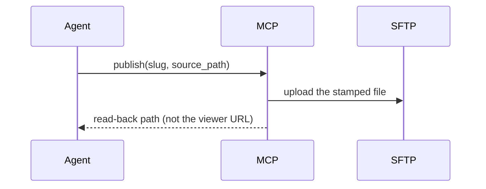

# Show me

Show the current topic visually. Skip the preamble, keep prose short, pick the
**smallest** view that makes the point.

## Comprehension first

The job is not to be complete. The job is to make someone who knows nothing about
this topic understand it — a big picture and few words. Depth is a follow-up, never
the default: when the reader wants full detail or a real technical document, they
ask, and *that* is the moment to go deeper or to build a separate artifact for it.

This posture is adapted from the `eli5` skill
(<https://github.com/anthropics/claude-plugins-community/tree/main/eli5>, MIT).

Simplify by **leaving things out**, never by **renaming things**:

- ✅ `artifact_sftp.publish` ทำหน้าที่เหมือนบุรุษไปรษณีย์ — รับของ ส่ง แล้วยืนยันว่าถึงมือ
- ❌ บุรุษไปรษณีย์รับไฟล์ไปส่งให้ตู้ปลายทาง

An analogy sits **beside** the real name; it never replaces it. A reader who greps
for a word you invented finds nothing, which is worse than not explaining at all.
*Never invent a label*, under **Rules**, binds here too.

**Source.** The seven forms below are adapted from humanlayer's `show-me` skill,
MIT-licensed: <https://github.com/humanlayer/skills/blob/main/plugins/show-me/skills/show-me/SKILL.md>.
The examples and the rules after them are this repository's.

## The forms

Logic or an algorithm — pseudocode:

```text
on(publish)
  if the file is not one regular .html under project_path
    refuse
  archive locally, then upload
  return the read-back path, never the viewer URL
```

Runtime control flow — a call tree:

```text
artifact_sftp.publish
  readiness check          # resolved against a real interpreter
  stamp + upload over SFTP
  archive + read-back
```

File responsibility or a refactor — a shallow file tree:

```text
src/artifact_sftp_mcp/
├── server.py     # the MCP surface, and the only one
├── service.py    # argv, environment, script contracts
└── models.py     # what a tool may return
```

Interaction over time — Mermaid:



What CHANGES, when the surrounding shape already exists — a diff, in whatever
shape the topic is:

```diff
 environment = minimal, allowlisted
 environment["PATH"] = inherited
+environment["PATH"] = without this adapter's own venv
```

The whole block when most of it is new, or when the reader needs a copyable
target shape — plain code.

## The primary output: an audited, published HTML artifact

For any rich diagram, architectural layout, state comparison, UI wireframe, or
visual walkthrough:

1. **Write one focused, standalone HTML page** into the selected absolute
   `project_path` — inline CSS, JavaScript and assets, responsive layout, large
   visuals and few words per the posture above. The publisher adds the approved
   Sarabun stylesheet for Thai text; add no other external CDN dependency.

2. **Run the `artifact-audit` pre-flight gate. Every time. There is no exception,
   and no "it's just a picture" path around it.** Render its gate table to the user
   and act on the verdict:

   | Verdict | What happens next |
   |:---:|---|
   | 🟢 **PASS** | continue to step 3 |
   | 🟡 **WARN** | show every warning, then continue to step 3 |
   | 🔴 **BLOCK** | **halt.** Route to the named remediation skill (`thai-prose-craft`, `visual-illustrator`, `artifact-curator`, `doc-synchronizer`), repair the source, re-audit. Never publish a BLOCK. |

3. **Publish through `artifact_sftp.publish`.**

   - **🟢 PASS and `private` — publish immediately, do not ask.** Call
     `artifact_sftp.publish` with `confirm: true` and a clean `slug`, and report the
     result. Approval for this case is granted **in advance, here in this skill**, by
     the repository owner; it is a standing authorization, not a skipped one. A user
     who wants to be asked says so in the turn, and that overrides this line for the turn.
   - **🟡 WARN** — publish only after the user explicitly acknowledges the warnings,
     or remediate first and re-audit to 🟢 PASS.
   - **`public` — never automatic, at any verdict.** Public publishing always needs
     explicit public-sharing approval in the turn, plus `confirm_public: true`.

4. **Report the published URL and the local read-back reference** (e.g.
   `docs/artifacts/<tool>/<visibility>/<slug>/...`) and end the turn. Do NOT perform
   redundant post-publish verification — no `artifact_sftp.read`, no browser fetch.
   `publish` has already scanned the source for secrets, archived the bytes locally,
   uploaded them, and probed the URL anonymously to prove a private artifact is not
   exposed. **Report its `verification` field as it comes back, and never upgrade it.**
   A private publish with no Cloudflare service token returns
   `content: not_independently_byte_verified` — that is an unverified upload, not a
   byte match, and calling it one is the exact overstatement this skill exists to avoid.

*For simple inline code, call trees, diffs, or quick Mermaid diagrams, an inline
snippet is the whole answer — no artifact, no gate, no publish.*

## Rules

- **A number is not a picture, and a picture is not a measurement.** A diagram
  proves a shape and cannot prove a quantity; a measurement proves a quantity and
  cannot prove a shape. If the answer turns on both, show both, and say which
  claim rests on which.
- **Draw what IS, not what was planned.** Read the code before drawing it. A
  picture of the intended design, presented as the system, is believed and not
  checked — the most expensive kind of wrong.
- **Simple is not the same as approximately true.** Comprehension first buys you
  fewer boxes and fewer words. It does not buy you a wrong arrow, a renamed tool,
  or a step that does not exist.
- **Say what the picture leaves out.** Every form above is a reduction, and this
  skill reduces harder than most. Name what you dropped when dropping it could
  change the reader's decision.
- **Never invent a label.** Tools, scripts and fields have names here; use them
  exactly, or a reader goes looking for something that does not exist.
- **One view, usually.** Several only when they answer different questions.
- **Never draw a secret.** Config paths, key locations and endpoints appear in
  this system's diagrams; the values behind them never do.
