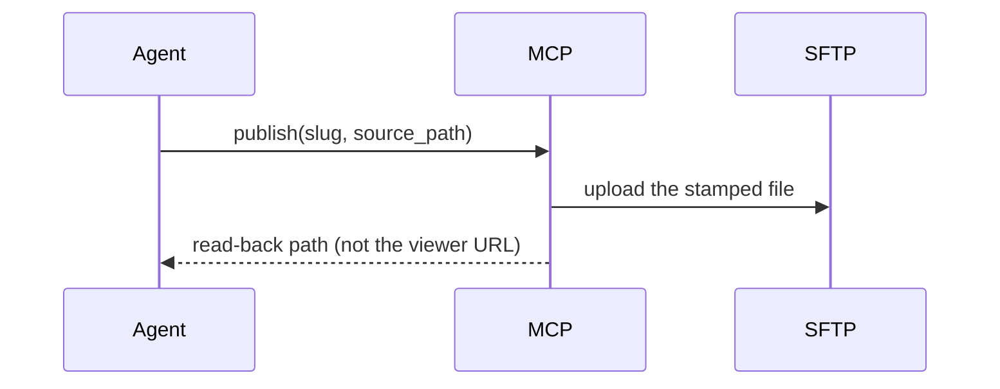

# Show me

Show the current topic visually. Skip the preamble, keep prose short, pick the
**smallest** view that makes the point.

**Source.** The seven forms below are adapted from humanlayer's `show-me` skill,
MIT-licensed: <https://github.com/humanlayer/skills/blob/main/plugins/show-me/skills/show-me/SKILL.md>.
The examples and the rules after them are this repository's.

## The forms

Logic or an algorithm — pseudocode:

```text
on(publish)
  if the file is not one regular .html under project_path
    refuse
  archive locally, then upload
  return the read-back path, never the viewer URL
```

Runtime control flow — a call tree:

```text
artifact_sftp.publish
  setup.sh --status        # readiness, resolved against a real interpreter
  publish.sh
    sftp_helper.py upload
  archive + read-back
```

File responsibility or a refactor — a shallow file tree:

```text
src/artifact_sftp_mcp/
├── server.py     # the MCP surface, and the only one
├── service.py    # argv, environment, script contracts
└── models.py     # what a tool may return
```

Interaction over time — Mermaid:



What CHANGES, when the surrounding shape already exists — a diff, in whatever
shape the topic is:

```diff
 environment = minimal, allowlisted
 environment["PATH"] = inherited
+environment["PATH"] = without this adapter's own venv
```

The whole block when most of it is new, or when the reader needs a copyable
target shape — plain code.

A layout, a state comparison, or something too dense for Mermaid — one focused
HTML file. **Publish it through `artifact_sftp.publish` and hand back the
read-back path**, rather than leaving it in a temp directory: this repository
exists to make a page shareable, and a diagram that only lives on one machine is
the thing it was built to replace.

## Rules

- **A number is not a picture, and a picture is not a measurement.** A diagram
  proves a shape and cannot prove a quantity; a measurement proves a quantity and
  cannot prove a shape. If the answer turns on both, show both, and say which
  claim rests on which.
- **Draw what IS, not what was planned.** Read the code before drawing it. A
  picture of the intended design, presented as the system, is believed and not
  checked — the most expensive kind of wrong.
- **Say what the picture leaves out.** Every form above is a reduction. Name what
  you dropped when dropping it could change the reader's decision.
- **Never invent a label.** Tools, scripts and fields have names here; use them
  exactly, or a reader goes looking for something that does not exist.
- **One view, usually.** Several only when they answer different questions.
- **Never draw a secret.** Config paths, key locations and endpoints appear in
  this system's diagrams; the values behind them never do.
