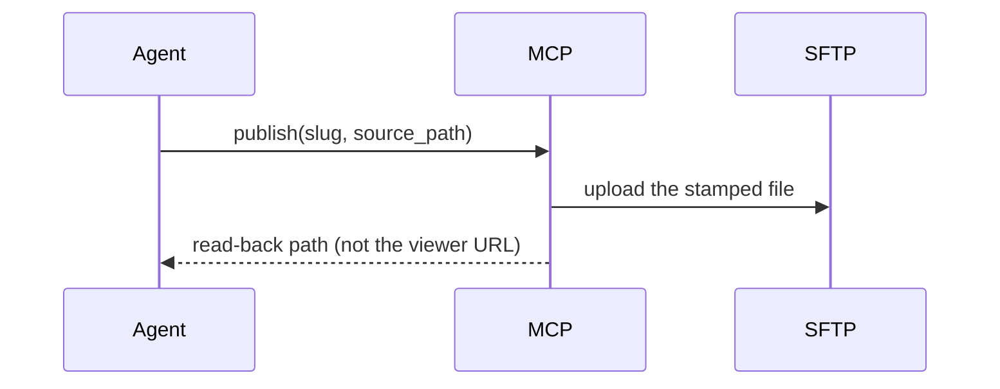

# Show Me

Explain any system, change, workflow, architecture, or codebase topic visually with instant clarity, plain language, and verifiable receipts.

---

## 1. The 3 Mandatory Pillars (The Triad of Trust)

Adapted from the official **ELI5** answer engine (<https://eli5.cc/>, <https://eli5.cc/how-it-works>). Every `show-me` output (whether a concise inline response or a published HTML artifact) **MUST satisfy all three pillars simultaneously**:

```text
       ┌────────────────────────────────────────────────────────┐
       │             THE 3 PILLARS OF SHOW-ME                   │
       └────────────────────────────────────────────────────────┘
                                 ▲
        ┌────────────────────────┼────────────────────────┐
        │                        │                        │
  ┌─────┴──────────┐   ┌─────────┴──────────┐   ┌─────────┴──────────┐
  │ 1. VISUAL      │   │ 2. PLAIN           │   │ 3. CHECKABLE       │
  │    DIAGRAM     │   │    LANGUAGE        │   │    SOURCES         │
  ├────────────────┤   ├────────────────────┤   ├────────────────────┤
  │ Topic-specific │   │ Human, punchy,     │   │ Inspectable trail  │
  │ visual map     │   │ anti-slop prose    │   │ and receipts       │
  │ (SVG, Mermaid, │   │ with real-world    │   │ (Clickable files,  │
  │  Tree, Diff)   │   │ analogies          │   │  lines & specs)    │
  └────────────────┘   └────────────────────┘   └────────────────────┘
```

1. **🖼️ VISUAL DIAGRAM (แผนภาพประกอบที่ตรงเป้า):**
   - Must contain a visual representation matched to the depth tier: pseudocode, call tree, shallow file tree, Mermaid sequence/flowchart, diff block, or an audited responsive SVG with Viewport Lightbox.
2. **✍️ PLAIN LANGUAGE (ภาษาธรรมชาติ กระชับ เข้าใจง่าย):**
   - Explain with human, punchy, anti-slop prose.
   - **Analogy Sits Beside Real Name:** Everyday comparisons sit *beside* real technical names; they never replace them.
     - ✅ `artifact_sftp.publish` ทำหน้าที่เหมือนบุรุษไปรษณีย์ — รับของ ส่ง แล้วยืนยันว่าถึงมือ
     - ❌ บุรุษไปรษณีย์รับไฟล์ไปส่งให้ตู้ปลายทาง
3. **🔗 CHECKABLE SOURCES / THE RECEIPTS (แหล่งอ้างอิงที่คลิกตรวจได้จริง):**
   - The answer must provide an inspectable evidence trail. Include exact clickable markdown links with line ranges to real source files (e.g. [`server.py:L35-L48`](file:///Users/ngs/agent-skills/plugins/artifact-sftp/src/artifact_sftp_mcp/server.py#L35-L48)), configuration keys, commit hashes, or official RFC/spec references.

---

## 2. One Idea, Four Depths (Official ELI5.cc Tiers)

The underlying topic can be viewed at four distinct depths. Start with intuition, and move toward technical precision without starting over:

| Tier | Level Name | Target Audience | Focus & Visual Characteristics |
|:---:|:---|:---|:---|
| **Level 1** | **`ELI5`** *(Default)* | Beginners, Stakeholders, High-level view | **"Build the basic mental picture with plain language and familiar comparisons."**<br>• 3–4 core boxes max, zero jargon barrier.<br>• Relatable everyday analogy alongside real system names.<br>• 1–2 primary entrypoint source links. |
| **Level 2** | **`ELI10`** | Junior Devs, Casual Learners | **"Add the important context and explain how the pieces fit together."**<br>• 4–6 boxes showing Input ➔ Processing ➔ Output pipeline.<br>• Clear cause-and-effect and data movement flow.<br>• Key controller/router/service source links. |
| **Level 3** | **`ELI15`** | Developers, QA, Integration Engineers | **"Introduce useful terminology, mechanisms and more precise relationships."**<br>• Sequence diagrams, API endpoints, HTTP methods, and status codes.<br>• Data schemas, payload models, and state transitions.<br>• Exact function signatures and handler file/line links. |
| **Level 4** | **`Expert`** | Staff / Lead Architects, DevOps | **"Give a compact, technically precise view for readers ready to go deeper."**<br>• Full multi-tier architecture, network boundaries, and failover topologies.<br>• Invariants, concurrency, race conditions, failure modes, cache invalidation.<br>• Complete source audit trail, security boundaries, and test suites. |

---

## 3. Invocation Syntax & Depth Controls

### A. Explicit Flag Syntax
Specify the exact depth using `--depth <tier>` or `--depth <1..4>`:
```text
/show-me --depth eli5 <topic>      # Level 1 (Default)
/show-me --depth eli10 <topic>     # Level 2
/show-me --depth eli15 <topic>     # Level 3
/show-me --depth expert <topic>    # Level 4
```

### B. Natural Language Intent Routing
- **`ELI5` (Default if unspecified):** *"show me ...", "วาดภาพให้ดูหน่อย", "อธิบายแบบง่ายๆ", "เด็ก 5 ขวบ"*
- **`ELI10`:** *"ขอแบบ ELI10 / เด็ก 10 ขวบ", "สรุป flow การเชื่อมต่อแบบเห็นภาพรวม"*
- **`ELI15`:** *"ขอแบบ ELI15", "แสดงกลไก API interaction และ data flow"*
- **`Expert`:** *"ขอแบบ Expert / Deep-Dive", "วิเคราะห์สถาปัตยกรรม, failure modes และ invariants"*

### C. Progressive Deepening
When a reader reviews an `ELI5` explanation and asks a follow-up (*"Go deeper on Auth"*, *"ขอเจาะลึกตรง Gateway"*), smoothly step up to `ELI10`, `ELI15`, or `Expert` for that specific component without repeating the basic introduction.

---

## 4. The Visual Forms

Choose the **smallest** form that settles the question:

Logic or an algorithm — **Pseudocode**:
```text
on(publish)
  if the file is not one regular .html under project_path
    refuse
  archive locally, then upload
  return the read-back path, never the viewer URL
```

Runtime control flow — **Call Tree**:
```text
artifact_sftp.publish
  readiness check          # resolved against a real interpreter
  stamp + upload over SFTP
  archive + read-back
```

File responsibility or layout — **Shallow File Tree**:
```text
src/artifact_sftp_mcp/
├── server.py     # the MCP surface, and the only one
├── service.py    # argv, environment, script contracts
└── models.py     # what a tool may return
```

Interaction over time — **Mermaid**:


System change — **Diff**:
```diff
 environment = minimal, allowlisted
 environment["PATH"] = inherited
+environment["PATH"] = without this adapter's own venv
```

---

## 5. The Primary Output: Audited, Published HTML Artifact

For any rich diagram, architectural layout, state comparison, UI wireframe, or visual walkthrough:

1. **Write one focused, standalone HTML page** into the selected absolute `project_path` — inline CSS, JavaScript and assets, responsive layout, large visuals, and few words per the chosen depth tier. Include a visible **Depth Badge** (e.g. `🎯 Level: ELI5` or `🎯 Level: Expert`).
2. **Published rich-diagram contract:** Rich diagrams MUST follow **Option 4 (Static Sanitized Inline SVG Delivery)**: static, sanitized, responsive inline SVG. Overview fits 100% container (`max-width: 100%; overflow: hidden;` no horizontal scroll). Provide the 100% borderless fullscreen **Viewport Lightbox / Expand Detail** modal with Pan & Zoom transform.
3. **Run the `artifact-audit` pre-flight gate. Every time. There is no exception:**
   - 🟢 **PASS & private:** Call `artifact_sftp.publish` immediately (pre-authorized).
   - 🟡 **WARN:** Present warnings for user confirmation before publish.
   - 🔴 **BLOCK:** **Halt.** Route to remediation skill, repair source, re-audit. Never publish a BLOCK.
4. **Report the published URL, local read-back reference, and checkable source links.**

---

## 6. Core Rules & Invariants

- **A number is not a picture, and a picture is not a measurement.** A diagram proves a shape; a measurement proves a quantity. Show both when needed.
- **Draw what IS, not what was planned.** Read the actual source code before drawing.
- **Simple is not the same as approximately true.** Reduction buys you fewer boxes and fewer words. It never buys a wrong arrow, a renamed tool, or a fictional step.
- **Say what the picture leaves out.** Name what was dropped when it could affect a decision.
- **Never invent a label.** Use exact codebase symbols and file paths.
- **Never draw a secret.** Config paths and key locations can appear; credentials never do.
- **Always provide Checkable Sources.** Attach the evidence trail so the reader can verify the facts.
