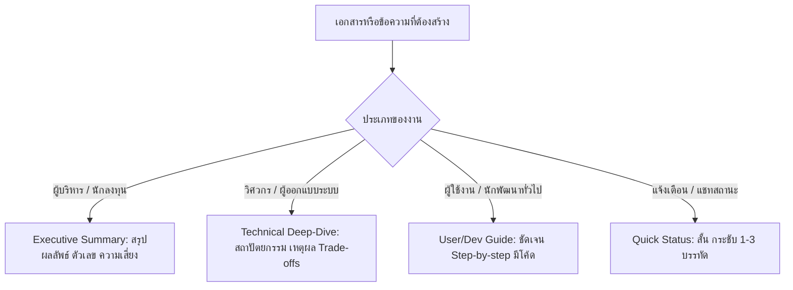

# Thai Prose Craft (`thai-prose-craft`)

คู่มือและทักษะการเขียนภาษาไทยระดับมืออาชีพ (Executive & Expert Level Thai Prose) สำหรับ AI Agent และผู้พัฒนา เพื่อสร้างงานเขียนที่มีชีวิตชีวา กระชับ ตรงประเด็น เป็นธรรมชาติ และปราศจากกลิ่นอายภาษาแปลหุ่นยนต์ (AI Slop / Robotic Translationese)

---

## 1. Mission & Philosophy (ปรัชญาและพันธกิจ)

งานเขียนภาษาไทยที่ดีสำหรับงานเทคนิค สรุปผู้บริหาร และเอกสารทางการ ต้องยึดหลักสำคัญ 3 ประการ:

1. **Human-First & Direct Mindset (เขียนจากวิธีคิดแบบไทย ไม่ใช่แปลคำต่อคำ)**
   - คิดและถ่ายทอดประเด็นออกมาเป็นภาษาไทยโดยตรง ไม่ยึดติดกับโครงสร้างไวยากรณ์ภาษาอังกฤษ (Word-by-word structural translation)
   - ถ่ายทอดด้วยน้ำเสียงของผู้เชี่ยวชาญ (Subject Matter Expert) ที่มีความมั่นใจ แม่นยำ และสุภาพ

2. **High Signal-to-Noise Ratio (เนื้อหาเข้มข้น ไร้น้ำและคำเกริ่นฟุ่มเฟือย)**
   - ตัดทิ้งคำสร้อย คำอารัมภบท และวลีเติมเต็ม (Filler words) ที่ไม่ก่อให้เกิดคุณค่าทางข้อมูล
   - เน้นใจความสำคัญ (Key Takeaway), การกระทำ (Action), และผลลัพธ์ (Impact) ขึ้นก่อนเสมอ

3. **Zero Tolerance for AI Slop (กวาดล้างสำนวนและศัพท์แสงหุ่นยนต์อย่างเด็ดขาด)**
   - ต่อต้านคำแปลสำนวนภาษาอังกฤษแบบประดิษฐ์ เช่น "ในตอนท้ายของวัน", "ปลดล็อคศักยภาพ", "ก้าวไปอีกขั้น"
   - แปลงโครงสร้างประโยคถูกกระทำ (Passive Voice) ให้เป็นประโยคประธานกระทำ (Active Voice) ที่เป็นธรรมชาติของภาษาไทย

---

## 2. Banned Clichés & Negative Lexicon (The Anti-AI Slop Rulebook)

### 2.1 บัญชีคำและวลีต้องห้าม (Banned AI Clichés & Tropes)

ห้ามใช้วลีต่อไปนี้โดยเด็ดขาด ให้ตัดทิ้งหรือแทนที่ด้วยประโยคที่ตรงไปตรงมา:

| วลี AI Slop / หุ่นยนต์ | ต้นทางภาษาอังกฤษ | ปัญหา | วิธีแก้ไข / คำทดแทนที่ถูกต้อง |
| :--- | :--- | :--- | :--- |
| **"ในโลกที่เปลี่ยนแปลงอย่างรวดเร็ว..."** | In a fast-paced / rapidly changing world | คำเกริ่นไร้สาระ น่าเบื่อ | **ตัดทิ้งทันที** แล้วระบุปัญหาหรือบริบททางเทคนิค/ธุรกิจโดยตรง |
| **"ในตอนท้ายของวัน..."** | At the end of the day | แปลสำนวนอังกฤษทื่อๆ | ใช้ **"ท้ายที่สุด", "โดยสรุป", "หัวใจสำคัญคือ"** หรือตัดทิ้ง |
| **"เป็นสิ่งสำคัญที่ต้องจำไว้ว่า..."** | It is important to remember that | อารัมภบทเยิ่นเย้อ ชะลอความเข้าใจ | ใช้ **"ข้อสำคัญ:", "หมายเหตุ:", "ข้อควรระวัง:"** หรือขึ้นใจความหลักทันที |
| **"มีบทบาทสำคัญอย่างยิ่งในการ..."** | Plays a crucial role in... | สำนวนแปลซ้ำซาก ขาดความชัดเจน | ใช้ **"ช่วยให้...", "จำเป็นต่อ...", "ส่งผลโดยตรงต่อ..."** |
| **"ก้าวไปอีกขั้น / ยกระดับไปอีกขั้น"** | Take it to the next level | คำโฆษณาลอยๆ ไร้ข้อมูลรองรับ | ระบุการปรับปรุงที่วัดผลได้ เช่น **"เพิ่มประสิทธิภาพ...", "ขยายขีดความสามารถ..."** |
| **"ปลดล็อคศักยภาพ / ปลดปล่อยพลัง"** | Unlock the potential / Unleash power | วลีการตลาด AI ยุคเก่า | ใช้ **"ดึงประสิทธิภาพสูงสุด", "ใช้งานฟังก์ชัน...ได้อย่างเต็มที่"** |
| **"ดำดิ่งสู่..."** | Dive into / Deep dive | แปลสำนวนอังกฤษตรงตัวผิดจังหวะ | ใช้ **"เจาะลึก...", "สำรวจ...", "วิเคราะห์...", "ดูรายละเอียด..."** |
| **"ไม่ว่าคุณจะเป็น...หรือไม่ก็ตาม"** | Whether you are a ... or not | ประโยคยืดเยื้อของ AI | **ตัดทิ้ง** แล้วระบุกลุ่มผู้ใช้หรือฟังก์ชันการใช้งานตรงๆ |
| **"การเดินทางของ..."** | The journey of... | วลีเปรียบเปรยพร่ำเพรื่อ | ใช้ **"ขั้นตอนการทำงาน", "กระบวนการ", "วิวัฒนาการของระบบ"** |
| **"โซลูชันที่ทรงพลัง"** | A powerful solution | คำชมไร้ความหมาย | ระบุคุณสมบัติจริง เช่น **"ระบบที่รองรับ 10,000 TPS"** |
| **"อย่าลังเลที่จะ..."** | Don't hesitate to... | สำนวนบริการลูกค้าของบ็อต | ใช้ **"สามารถติดต่อทีมงาน...", "ดำเนินการ...ได้ทันที"** |

---

### 2.2 การแปลง Passive Voice เป็น Active Voice (กำจัดไวยากรณ์ถูกกระทำแบบฝรั่ง)

ในภาษาไทย คำว่า **"ถูก"** หรือ **"โดน"** มักใช้กับเหตุการณ์เชิงลบหรือผลกระทบที่ไม่พึงประสงค์ (เช่น *ถูกปฏิเสธ, ถูกแฮก, โดนโจมตี, ถูกลบข้อมูล*) 
ห้ามใช้โครงสร้าง **"ถูก [กริยา] โดย [กรรม/ผู้กระทำ]"** ในข้อความทั่วไป:

| สำนวนแปลทื่อแบบ Passive (ห้ามใช้ ❌) | ภาษาไทยธรรมชาติแบบ Active (แนะนำ ✅) |
| :--- | :--- |
| โค้ดนี้ถูกเขียนขึ้นโดยทีมพัฒนา | ทีมพัฒนาเขียนโค้ดนี้ |
| ไฟล์คอนฟิกถูกอ่านโดยเซิร์ฟเวอร์ | เซิร์ฟเวอร์อ่านไฟล์คอนฟิก |
| ข้อมูลผู้ใช้จะถูกส่งไปยัง Endpoint โดยแอปพลิเคชัน | แอปพลิเคชันส่งข้อมูลผู้ใช้ไปยัง Endpoint |
| ข้อผิดพลาดนี้สามารถถูกแก้ไขได้โดยการรันสคริปต์ | รันสคริปต์นี้เพื่อแก้ไขข้อผิดพลาด |
| คำขอถูกปฏิเสธเนื่องจากสิทธิ์ไม่เพียงพอ | ระบบปฏิเสธคำขอเนื่องจากสิทธิ์ไม่เพียงพอ *(คำว่า "ถูกปฏิเสธ" ยอมรับได้เพราะเป็นผลลบ แต่ active ชัดเจนกว่า)* |

---

### 2.3 การลดคำเชื่อมซ้ำซากและคำเติมเต็ม (Fillers & Redundant Words)

- **ตัดคำว่า "ทำการ..." ทิ้งเกือบทั้งหมด**:
  - ❌ *ทำการตรวจสอบโค้ด*, *ทำการส่งอีเมล*, *ทำการบันทึกข้อมูล*
  - ✅ **ตรวจสอบโค้ด**, **ส่งอีเมล**, **บันทึกข้อมูล**
- **ลดการใช้ "นอกจากนี้ยัง...", "อีกทั้งยัง...", "รวมถึงยัง..." ติดๆ กัน**:
  - ให้แยกประโยคใหม่, ใช้เครื่องหมายเว้นวรรค, หรือจัดรูปแบบเป็นรายการ (Bullet Points)
- **หลีกเลี่ยง "ทั้งนี้ทั้งนั้น", "อย่างไรก็ตามแต่"**:
  - เปลี่ยนเป็น **"แต่"**, **"ทว่า"**, **"ทั้งนี้"**, **"อย่างไรก็ดี"** หรือปรับบริบทประโยคให้กระชับ
- **ตัดคำว่า "มีความสามารถในการ..."**:
  - ❌ *โมดูลนี้มีความสามารถในการประมวลผล...*
  - ✅ **โมดูลนี้รองรับการประมวลผล...** หรือ **โมดูลนี้ประมวลผล...**
- **ตัดวลี "ในส่วนของ..." ที่ขึ้นต้นประโยค**:
  - ❌ *ในส่วนของฐานข้อมูล เราได้เลือกใช้ PostgreSQL...*
  - ✅ **เราเลือกใช้ PostgreSQL เป็นฐานข้อมูลหลัก...**

---

## 3. Technology Glossary & Contextual Translation Rules (คำศัพท์และคู่มือการทับศัพท์)

### 3.1 กลุ่มคำที่ควรคงไว้เป็นภาษาอังกฤษ (Keep in English)
ศัพท์เทคนิคเฉพาะทางที่คนในวงการไอที/วิศวกรรมซอฟต์แวร์เข้าใจตรงกัน การพยายามแปลเป็นไทยจะทำให้เข้าใจยากหรือเสียความหมาย:

- **การพัฒนาและ Source Control**: Frontend, Backend, Full-stack, API, Endpoint, Pull Request (PR), Commit, Branch, Merge, Rebase, Fork, Refactor, Lint, Code Review, Monorepo
- **ระบบและโครงสร้างสถาปัตยกรรม**: Webhook, Callback, Middleware, Cache, Payload, Token, Session, Queue, Event Loop, Microservices, Container, Docker, Kubernetes, CI/CD, Deployment, Pipeline, Worker, Polling
- **ฐานข้อมูลและการสืบค้น**: Schema, Query, Migration, ORM, Index, Sharding, Replica, Rollback, Foreign Key
- **UI Components**: Modal, Popover, Dropdown, Toggle, Tooltip, Toast Notification, Banner, Drawer, Carousel, Accordion
- **คำสั่งและสถานะ**: Build, Deploy, Test, Debug, Crash, Panic, Deprecated, Fallback, Dry-run

> **กฎการเขียนคำทับศัพท์ภาษาอังกฤษร่วมกับภาษาไทย**:
> 1. เว้นวรรคหน้าและหลังคำภาษาอังกฤษ 1 เคาะ เพื่อให้อ่านง่าย เช่น `ส่ง Request ไปยัง API Gateway` (ไม่ใช่ `ส่งRequestไปยังAPIGateway`)
> 2. พิมพ์ตัวพิมพ์เล็ก/ใหญ่ตามมาตรฐานเทคนิค (เช่น `TypeScript`, `GitHub`, `PostgreSQL`, `macOS`, `OAuth 2.0`)
> 3. ผันกริยาทับศัพท์อย่างเป็นธรรมชาติ เช่น `รัน Unit Test`, `ดีพลอย (Deploy) ขึ้น Staging`, `รีแฟกเตอร์ (Refactor) โค้ด`

---

### 3.2 กลุ่มคำที่ควรใช้คำไทยมาตรฐาน (Clear Thai Equivalents)
ศัพท์ทั่วไปหรือศัพท์เทคนิคที่มีคำแปลภาษาไทยที่กระชับ สละสลวย และสื่อความหมายได้ชัดเจน:

| คำภาษาอังกฤษ | คำไทยมาตรฐานที่แนะนำ | ตัวอย่างการใช้งาน |
| :--- | :--- | :--- |
| **Authentication** | การยืนยันตัวตน | ระบบยืนยันตัวตนผ่าน OTP |
| **Authorization** | การกำหนดสิทธิ์ / การตรวจสอบสิทธิ์ | ตรวจสอบสิทธิ์การเข้าถึงเมนูผู้ดูแลระบบ |
| **Configuration / Settings** | การตั้งค่า / ค่าคอนฟิก | ไฟล์ตั้งค่าสภาพแวดล้อม (.env) |
| **Database** | ฐานข้อมูล | สรุปโครงสร้างตารางฐานข้อมูล |
| **Documentation** | เอกสารประกอบ / คู่มือ | คู่มือการใช้งาน API |
| **Maintenance** | การดูแลรักษา / การบำรุงรักษา | กำหนดการปิดปรับปรุงระบบชั่วคราว |
| **Performance** | ประสิทธิภาพ / ความเร็ว | ปรับปรุงประสิทธิภาพการตอบสนอง |
| **Permissions** | สิทธิ์การเข้าถึง | กำหนดสิทธิ์การอ่านและเขียนไฟล์ |
| **Requirement** | ข้อกำหนด / ความต้องการของระบบ | วิเคราะห์ข้อกำหนดของระบบใหม่ |
| **Security** | ความปลอดภัย | มาตรการรักษาความปลอดภัยของข้อมูล |
| **Scalability** | ความสามารถในการรองรับการขยายตัว | ออกแบบระบบเพื่อรองรับการขยายตัวในอนาคต |
| **User Interface (UI)** | ส่วนติดต่อผู้ใช้ / หน้าจอการใช้งาน | ออกแบบส่วนติดต่อผู้ใช้ให้เรียบง่าย |
| **Vulnerability** | ช่องโหว่ความปลอดภัย | ตรวจพบช่องโหว่ระดับวิกฤต (Critical Vulnerability) |

---

### 3.3 การแปลผิดบริบทที่ต้องหลีกเลี่ยงอย่างเด็ดขาด (Bad Literal Translations to AVOID)

| คำศัพท์เทคนิค | คำแปลตรงตัวผิดบริบท (ห้ามใช้ ❌) | คำที่ถูกต้องและเป็นธรรมชาติ (✅) |
| :--- | :--- | :--- |
| **Pull Request (PR)** | "ดึงคำขอ", "คำขอดึง" | **Pull Request** หรือ **PR** |
| **API Endpoint** | "จุดสิ้นสุด", "ปลายทาง" | **Endpoint** หรือ **API Endpoint** |
| **Fork (Repo)** | "ส้อม" | **Fork** |
| **Cache Invalidation** | "การทำให้แคชไม่ถูกต้อง" | **การล้าง Cache** หรือ **Cache Invalidation** |
| **Return (function/method)** | "ส่งคืน" | **ส่งค่ากลับ**, **คืนค่า** |
| **Driver (DB / Hardware)** | "คนขับ" | **Driver** |
| **Dependency Injection (DI)**| "การฉีดการพึ่งพา" | **Dependency Injection** หรือ **DI** |
| **Hot Reload** | "การโหลดซ้ำแบบร้อน" | **Hot Reload** |
| **Garbage Collection (GC)** | "การเก็บขยะ" *(เว้นแต่จะอธิบายหลักการ)* | **Garbage Collection (GC)** หรือ **ระบบคืนหน่วยความจำอัตโนมัติ** |
| **Breaking Change** | "การเปลี่ยนแปลงที่แตกหัก" | **การเปลี่ยนแปลงที่ไม่รองรับเวอร์ชันเดิม (Breaking Change)** |

---

## 4. Sentence Crafting Patterns (รูปแบบและเทคนิคการเรียบเรียงประโยค)

1. **Action-First Hierarchy (นำประเด็นสำคัญและการกระทำขึ้นก่อน)**
   - นำสิ่งที่ผู้อ่านต้องทำหรือรู้ทันทีขึ้นเป็นท่อนแรกของประโยค
   - *ตัวอย่าง*: `รันคำสั่ง npm test เพื่อตรวจสอบความถูกต้องของสคริปต์` ดีกว่า `เพื่อตรวจสอบความถูกต้องของสคริปต์ ให้คุณทำการรันคำสั่ง npm test`

2. **Subject-Verb Clarity (ประธาน-กริยา-กรรม ชัดเจน)**
   - ไม่แต่งประโยคซ้อนเกิน 2 ชั้น หากมีเงื่อนไขซับซ้อนให้แยกเป็นประโยครองหรือใช้สัญลักษณ์หัวข้อย่อย
   - ระบุผู้กระทำชัดเจน (เช่น ระบบ, ผู้ดูแล, เซิร์ฟเวอร์, ผู้ใช้)

3. **Short & Punchy Sentences (ประโยคสั้น กระชับ คมชัด)**
   - 1 ประโยค = 1 ความคิดหลัก
   - หากประโยคยาวเกิน 2 บรรทัด ให้พิจารณาตัดแบ่งเป็น 2 ประโยค หรือใช้ Bullet Points

4. **Structured Layout with Progressive Disclosure (จัดโครงสร้างให้อ่านง่าย)**
   - ใช้หัวข้อย่อย (Headings `##`, `###`), กล่องข้อความ (Callout Alerts), ตาราง (Tables), และรายการ (Bullet lists)
   - ข้อมูลสำคัญที่สุดอยู่ด้านบน รายละเอียดเชิงลึกอยู่ตามลำดับ

5. **Natural Thai Spacing (การเว้นวรรคภาษาไทย)**
   - ภาษาไทยไม่ใช้เครื่องหมายคอมมา (`,`) หรือเซมิโคลอน (`;`) พร่ำเพรื่อในประโยคบรรยาย ให้ใช้การเคาะเว้นวรรค 1 จังหวะแทน
   - เว้นวรรค 1 เคาะก่อนและหลังตัวเลขและคำภาษาอังกฤษเสมอ

---

## 5. Before & After Concrete Examples (ตัวอย่างเปรียบเทียบก่อน-หลัง)

### ตัวอย่างที่ 1: ภาพรวมสถาปัตยกรรมทางเทคนิค (Technical Architecture Overview)

❌ **แบบ AI Slop / หุ่นยนต์แปลตรงตัว:**
> "ในโลกของการพัฒนาซอฟต์แวร์ที่มีการเปลี่ยนแปลงอย่างรวดเร็ว เป็นสิ่งสำคัญอย่างยิ่งที่จะต้องเข้าใจว่าสถาปัตยกรรม Microservices ของเรานั้นถูกออกแบบมาเพื่อปลดล็อคศักยภาพในการขยายขนาดได้อย่างไร นอกจากนี้ยังมีการนำ Redis มาใช้ในการทำการแคชข้อมูลเพื่อเพิ่มประสิทธิภาพในการตอบสนอง และในส่วนของฐานข้อมูล MySQL ก็ได้ถูกปรับปรุงเพื่อการรองรับปริมาณงานที่ก้าวไปอีกขั้น"

✅ **แบบ Natural Thai Craft (กระชับ คมชัด สื่อสารตรงประเด็น):**
> ระบบนี้ใช้สถาปัตยกรรมแบบ **Microservices** เพื่อรองรับการขยายตัว (Scalability) ตามปริมาณผู้ใช้งาน โดยแยกแต่ละเซอร์วิสออกจากกันอย่างอิสระ พร้อมนำ **Redis Cache** มาช่วยลดภาระการอ่านข้อมูลซ้ำซ้อนจากฐานข้อมูล MySQL ส่งผลให้เวลาตอบสนอง (Response Latency) ของ API ลดลงกว่า 60%

---

### ตัวอย่างที่ 2: สรุปการแก้ไขโค้ดใน Pull Request (PR Review / Bug Fix Summary)

❌ **แบบ AI Slop / หุ่นยนต์แปลตรงตัว:**
> "ใน PR นี้ ได้มีการทำการแก้ไขข้อผิดพลาดที่ถูกค้นพบโดยผู้ใช้เกี่ยวกับการตรวจสอบสิทธิ์ โดยที่โทเค็นมีความสามารถในการหมดอายุเร็วกว่าเวลาที่กำหนด ทั้งนี้ทั้งนั้นการเปลี่ยนแปลงนี้จะช่วยให้มั่นใจได้ว่าประสบการณ์ของผู้ใช้จะถูกยกระดับ และอย่าลังเลที่จะทำการตรวจสอบโค้ดนี้"

✅ **แบบ Natural Thai Craft (กระชับ คมชัด สื่อสารตรงประเด็น):**
> **สรุปการแก้ไขใน PR นี้:**
> - แก้ไขปัญหา Access Token หมดอายุก่อนกำหนดในโมดูล Authentication
> - เพิ่มกลไก Refresh Token อัตโนมัติในเบื้องหลังก่อน Token เดิมหมดอายุ 5 นาที
> - เพิ่ม Unit Test ครอบคลุมกรณี Edge Case เมื่อ Network มีความหน่วงสูง

---

### ตัวอย่างที่ 3: ประกาศเปิดตัวฟีเจอร์ใหม่ (Product Feature Release Notes)

❌ **แบบ AI Slop / หุ่นยนต์แปลตรงตัว:**
> "เรามีความยินดีเป็นอย่างยิ่งที่จะประกาศเปิดตัวเครื่องมือใหม่ที่จะช่วยปฏิวัติกระบวนการทำงานของคุณ ไม่ว่าคุณจะเป็นนักพัฒนารายบุคคลหรือทีมงานขนาดใหญ่ เครื่องมือนี้มีบทบาทสำคัญในการช่วยคุณก้าวไปอีกขั้น ดำดิ่งสู่ความเป็นไปได้ใหม่ๆ ในการส่งออกรายงานได้แล้ววันนี้!"

✅ **แบบ Natural Thai Craft (กระชับ คมชัด สื่อสารตรงประเด็น):**
> **เปิดตัวระบบ Export ข้อมูลประสิทธิภาพสูง:**
> - **รองรับไฟล์หลากหลาย**: ส่งออกข้อมูลเป็น CSV, Excel (.xlsx) และ PDF
> - **ประมวลผลฉับไว**: จัดการชุดข้อมูลขนาด 100,000 แถวได้ภายใน 3 วินาที
> - **ทำงานเบื้องหลัง**: ระบบส่งลิงก์ดาวน์โหลดเข้าอีเมลอัตโนมัติเมื่อไฟล์พร้อม ไม่ต้องเปิดหน้าจอค้างไว้

---

### ตัวอย่างที่ 4: รายงานวิเคราะห์เหตุด่วนระบบขัดข้อง (Incident Post-Mortem)

❌ **แบบ AI Slop / หุ่นยนต์แปลตรงตัว:**
> "ในตอนท้ายของวัน สิ่งที่เกิดขึ้นคือเซิร์ฟเวอร์ฐานข้อมูลได้ถูกทำให้เกิดภาวะโอเวอร์โหลดโดยทราฟฟิกที่ไม่คาดคิด เป็นสิ่งสำคัญที่ต้องจำไว้ว่าการกู้คืนระบบได้รับการดำเนินการอย่างรวดเร็วโดยทีมวิศวกร และเราได้ทำการป้องกันไม่ให้ปัญหานี้เกิดขึ้นอีกในอนาคต"

✅ **แบบ Natural Thai Craft (กระชับ คมชัด สื่อสารตรงประเด็น):**
> **รายงานสรุปเหตุด่วน (Incident Post-Mortem):**
> - **อาการ**: ฐานข้อมูลไม่สามารถรับคำขอใหม่ได้ ส่งผลให้หน้าชำระเงินขัดข้อง 14 นาที (10:15 - 10:29 น.)
> - **สาเหตุหลัก**: มีทราฟฟิกแคมเปญไหลเข้าพร้อมกันจน Connection Pool ของฐานข้อมูลเต็ม (Pool Exhaustion)
> - **การแก้ไขทันที**: ขยาย Connection Pool ชั่วคราว และเปิดใช้งาน Rate Limiting บน API Gateway
> - **มาตรการป้องกันระยะยาว**: ปรับปรุง Slow Query, เปิดใช้งาน Read Replica เพิ่มเติม 2 โหนด และตั้งค่า Alert แจ้งเตือนเมื่อ Connection เกิน 75%

---

### ตัวอย่างที่ 5: คู่มือการติดตั้งระบบสำหรับผู้พัฒนา (Developer Setup Guide)

❌ **แบบ AI Slop / หุ่นยนต์แปลตรงตัว:**
> "ยินดีต้อนรับสู่คู่มือที่จะนำคุณดำดิ่งสู่การติดตั้งโปรเจกต์ โปรดอย่าลังเลที่จะทำการรันคำสั่งต่อไปนี้ตามลำดับ และตรวจสอบให้แน่ใจว่าไฟล์ .env ถูกตั้งค่าอย่างถูกต้องสมบูรณ์แบบเพื่อไม่ให้เกิดข้อผิดพลาดในการทำงาน"

✅ **แบบ Natural Thai Craft (กระชับ คมชัด สื่อสารตรงประเด็น):**
> **ขั้นตอนการติดตั้งระบบ:**
> 1. ติดตั้ง Dependencies:
>    ```bash
>    npm install
>    ```
> 2. คัดลอกและตั้งค่า Environment Variables:
>    ```bash
>    cp .env.example .env
>    ```
>    *(ระบุค่า `DATABASE_URL` และ `API_SECRET` ในไฟล์ `.env`)*
> 3. รัน Database Migration:
>    ```bash
>    npm run db:migrate
>    ```
> 4. เริ่มต้น Development Server:
>    ```bash
>    npm run dev
>    ```

---

## 6. Tone & Register Adaptation (การปรับโทนเสียงตามบริบทงาน)

ปรับแต่งน้ำเสียง ระดับภาษา และความละเอียดของเนื้อหาให้ตรงตามเป้าหมายของเอกสาร:



### 6.1 Executive Summary (สรุปผู้บริหาร / ผู้มีอำนาจตัดสินใจ)
- **น้ำเสียง**: มั่นใจ เด็ดขาด สุภาพ เป็นมืออาชีพ (Professional & Decisive)
- **จุดเน้น**: ผลลัพธ์ทางธุรกิจ (ROI/Outcome), ต้นทุน (Cost), กรอบเวลา (Timeline), และความเสี่ยง (Risk & Mitigation)
- **หลีกเลี่ยง**: รายละเอียดเชิงโค้ดบรรทัดต่อบรรทัด หรือศัพท์เทคนิคระดับลึกที่ไม่มีคำอธิบายผลกระทบ

### 6.2 Technical Deep-Dive (เอกสารสถาปัตยกรรม / Technical Spec)
- **น้ำเสียง**: เป็นกลาง แม่นยำ ชัดเจน มีหลักวิศวกรรมรองรับ (Precise & Analytical)
- **จุดเน้น**: สถาปัตยกรรมระบบ, Data Flow, Security Invariants, เหตุผลการตัดสินใจ (Rationale), และการชั่งน้ำหนักข้อดี-ข้อเสีย (Trade-offs)
- **การใช้คำ**: ทับศัพท์เทคนิคได้อย่างเต็มที่แต่แม่นยำ ไม่ดัดแปลงคำศัพท์มาตรฐาน

### 6.3 User / Developer Guide (คู่มือผู้ใช้ / เอกสารวิธีการ)
- **น้ำเสียง**: ชี้แนะ กระชับ เป็นมิตรแต่ตรงประเด็น (Instructive & Helpful)
- **จุดเน้น**: ขั้นตอนการลงมือทำ (Step 1, 2, 3), ตัวอย่างโค้ดหรือภาพหน้าจอจริง, ผลลัพธ์ที่ถูกต้อง (Expected Output), และการแก้ปัญหาเบื้องต้น (Troubleshooting)
- **หลีกเลี่ยง**: คำเกริ่นนำ ประวัติความเป็นมาที่ไม่จำเป็น

### 6.4 Quick Status / Chat Update (การรายงานสถานะฉับไว)
- **น้ำเสียง**: กระชับ ตรงเป้าหมาย จบในตัว (Crisp & Scannable)
- **จุดเน้น**: สถานะปัจจุบัน (สำเร็จ/กำลังทำ/ติดปัญหา), บล็อกเกอร์ (ถ้ามี), และก้าวถัดไป (Next Steps)
- **รูปแบบ**: ใช้สัญลักษณ์หัวข้อย่อย (Bullet points) ไม่พิมพ์ย่อหน้ายาว

---

## 7. Verification Checklist for the Agent (เกณฑ์การตรวจทานตนเอง)

ก่อนส่งมอบงานเขียนภาษาไทยทุกครั้ง ให้ AI Agent ตรวจสอบตนเองตามรายการตรวจสอบนี้:

- [ ] **ไม่มีวลี AI Slop ต้องห้าม**: ไม่มี "ในโลกที่...", "ในตอนท้ายของวัน", "ปลดล็อคศักยภาพ", "ก้าวไปอีกขั้น", "ดำดิ่งสู่"
- [ ] **ปราศจาก Passive Voice แบบแปลตรงตัว**: ไม่มี "ถูก [กริยา] โดย [ผู้กระทำ]" ในกรณีทั่วไป
- [ ] **ตัดคำว่า "ทำการ..."**: ตรวจสอบและตัดคำว่า "ทำการ" ออกทั้งหมด ยกเว้นกรณีที่เป็นคำนามเฉพาะ
- [ ] **ทับศัพท์เทคนิคถูกต้อง**: คงคำศัพท์สากล เช่น Endpoint, Pull Request, Cache, Deploy, Webhook ไว้เป็นภาษาอังกฤษอย่างถูกต้อง
- [ ] **เว้นวรรคคำภาษาอังกฤษและตัวเลข**: เคาะเว้นวรรค 1 ช่องหน้า-หลังคำภาษาอังกฤษและตัวเลขเพื่อให้อ่านง่าย
- [ ] **ตรงประเด็นและเน้นการกระทำ (Action-First)**: ตัดบทนำเยิ่นเย้อออก นำประเด็นหลักและผลลัพธ์ขึ้นต้นประโยค
- [ ] **จัดรูปแบบให้อ่านง่าย (Scannable)**: ใช้หัวข้อย่อย กล่องข้อความ และ Bullet Points ในจุดที่เหมาะสม
