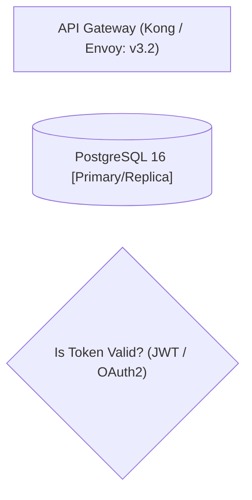
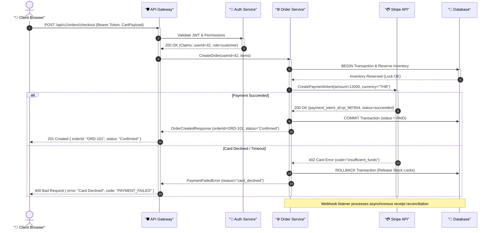
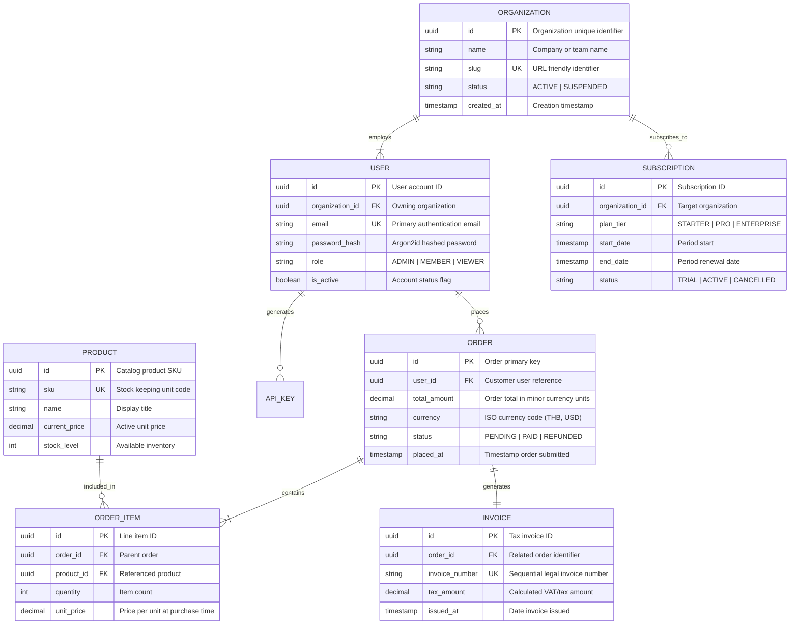
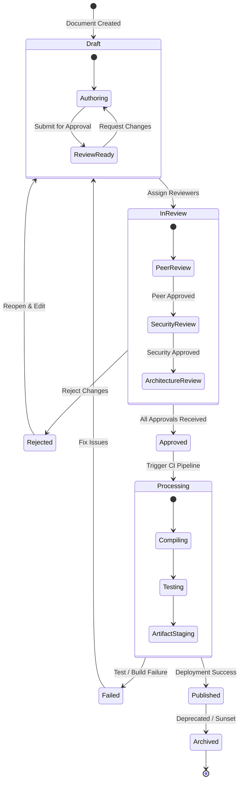
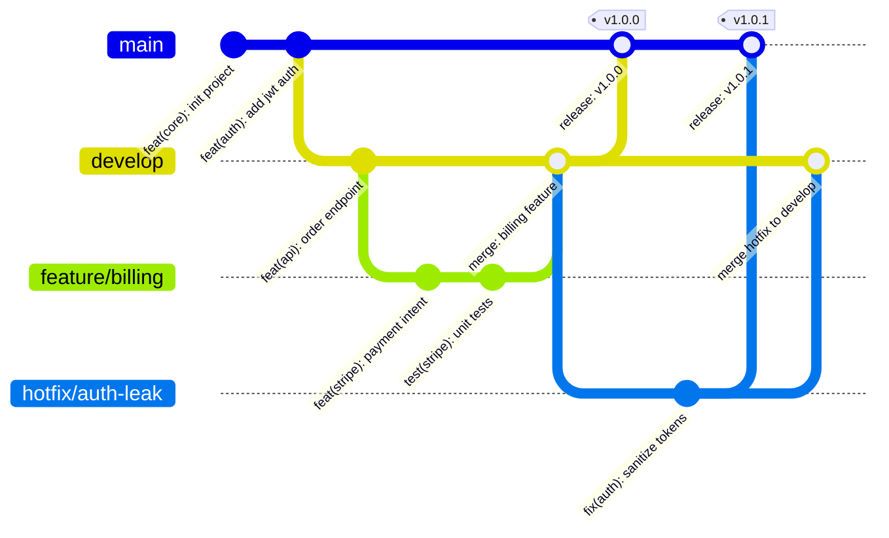
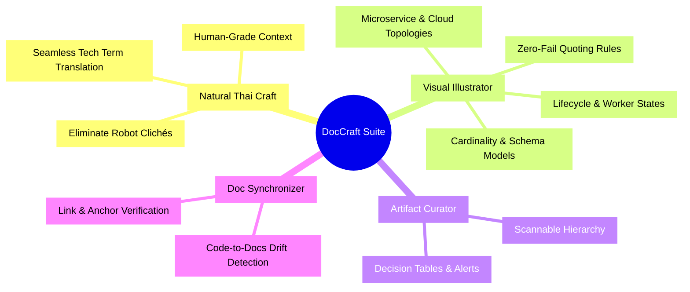

# Visual Illustrator: Robust Mermaid & Visual Diagram Generator

`visual-illustrator` is the authoritative guide and generator for technical diagrams in documentation, architectural RFCs, specifications, and executive artifacts. It ensures every visual diagram is syntactically resilient, visually balanced, immediately readable, and free from parser crashes.

---

## 1. Core Purpose & Philosophy

Visual diagrams must accelerate comprehension, not create cognitive burden. A good technical diagram communicates boundaries, protocols, lifecycles, and data relationships at a single glance.

### Principles
1. **Zero Render Failures**: Enforce strict syntax safety across all rendering engines (Mermaid.js CLI, GitHub Markdown, Notion, Obsidian, VS Code, and browser artifact previewers).
2. **Structural Clarity (Spaghetti-Free)**: Minimize criss-crossing edges, control layout flow deterministically, and establish natural visual hierarchies.
3. **Semantic Grouping**: Use clean subgraphs and boundary frames to isolate layers, services, security zones, and lifecycle stages.
4. **Professional Palette**: Use cohesive, accessible, soft enterprise colors with deliberate contrast—never raw neon or unreadable saturated accents.
5. **Comprehensiveness with Context**: Always pair diagrams with concise textual legends or narrative walk-throughs to provide end-to-end context.

---

## 2. Strict Syntax & Parsing Safety (The "Never Fail" Rules)

Mermaid parsers fail abruptly on unescaped symbols, malformed IDs, or deep subgraph recursion. Follow these non-negotiable rules for every generated diagram:

### Rule 1: Always Double-Quote Complex Node Labels
Any label containing spaces, parentheses `()`, brackets `[]`, braces `{}`, colons `:`, slashes `/`, hyphens `-`, quotes `"`, pipes `|`, or special characters **must** be enclosed in double quotes inside the shape delimiter.



```mermaid
%% INCORRECT - Unquoted punctuation triggers parser crashes
%% flowchart LR
%%     apiGateway[API Gateway (Kong: v3.2)]  <-- Syntax Error
```

### Rule 2: Safe Alphanumeric Node Identifiers
Use clean, descriptive `camelCase` or `snake_case` IDs containing only alphanumeric characters and underscores. Never use spaces, hyphens, numbers as initial characters, or special symbols in node IDs.

- **Safe**: `authService`, `db_postgres_primary`, `kafkaEventBus`, `clientApp`
- **Dangerous**: `auth-service`, `123_db`, `auth service`, `client.app`

### Rule 3: Avoid Raw HTML Inside Labels
Do not inject raw HTML tags (`<br>`, `<b>`, `<span>`, `<div>`, `<font>`) inside labels unless specifically targeting an environment with strict HTML trust enabled.
- For line breaks, use Mermaid's native string line break: `\n` inside double quotes.
- Example: `serviceA["Core Order Service\n(Port: 8080 | Go 1.22)"]`

### Rule 4: Explicit Orientation Declaration
Always declare diagram orientation explicitly at the top.
- `flowchart TD` (Top to Bottom): Ideal for multi-tiered systems, hierarchies, decision trees, and sequential workflows.
- `flowchart LR` (Left to Right): Ideal for data pipelines, microservice request chains, and end-to-end user journeys.

### Rule 5: Subgraph Nesting Safety (Max 2 Levels)
Limit nested subgraphs to a maximum of 2 levels (`Outer Zone` -> `Inner Cluster`). Deeply nested subgraphs cause layout calculation thrashing and overlapping node boxes.
- Always provide an explicit identifier and quoted title: `subgraph cluster_id ["Display Title"]`
- Always close every opened subgraph with an explicit `end`.

### Rule 6: Escape Reserved Keywords
Words such as `end`, `subgraph`, `state`, `class`, `style`, `graph`, `default`, `click` are reserved. If these words appear in titles or labels, wrap them in double quotes.

---

## 3. Core Diagram Archetypes & Production Templates

### Archetype 1: Architecture & System Component Flow (`flowchart`)
Used for microservice architectures, cloud infrastructure, network topology, and event-driven backends.


---

### Archetype 2: Sequence Diagrams (`sequenceDiagram`)
Used for API authentication flows, distributed transactions, checkout sequences, and webhook lifecycles.



---

### Archetype 3: Database Entity Relationship Diagrams (`erDiagram`)
Used for database schemas, relational modeling, entity cardinalities, and domain boundary mappings.

#### Cardinality Guide:
- `||--||` : Exactly 1 to Exactly 1
- `||--o{` : Exactly 1 to 0 or more (One-to-Many optional)
- `||--|{` : Exactly 1 to 1 or more (One-to-Many mandatory)
- `}|--o{` : Many to Many (via junction table recommended)



---

### Archetype 4: State Diagrams (`stateDiagram-v2`)
Used for state machines, background job workers, order fulfillment, deployment stages, and ticket workflows.



---

### Archetype 5: Git / Release Lifecycle & Project Mindmaps

#### Git Workflow & Release Branching (`gitGraph`)


#### Strategic Product Mindmap (`mindmap`)


---

## 4. Visual Ergonomics & Aesthetic Styling

### Anti-Spaghetti Rules (Preventing Tangled Lines)
1. **Linear Ordering**: Place components in the natural direction of data flow (e.g., in `TD`, define Clients at the top, Gateway next, Services middle, Storage bottom).
2. **Subgraphs as Guardrails**: Enclose related components inside named subgraphs. This forces the layout engine to group nodes and prevents long criss-crossing vectors.
3. **Decouple Asynchronous Paths**: Use dashed lines `-.->` or event buses/queues rather than direct point-to-point links across distant layers.
4. **Split Oversized Diagrams**: If a single diagram exceeds 15 nodes with multiple cross-connections, split it into:
   - Level 1: System Context Diagram (Broad boundaries)
   - Level 2: Component Deep-Dive Diagram (Specific subsystem flow)

### Enterprise Palette Standard (`classDef`)
Avoid default neon greens or high-saturation purples. Apply soft pastel fills with deep, legible borders and contrasting text:

| Style Class | Fill Hex | Stroke Hex | Text Hex | Use Case |
| :--- | :--- | :--- | :--- | :--- |
| `primary` | `#e0f2fe` | `#0284c7` | `#0369a1` | Frontend, user-facing layers, primary actors |
| `service` | `#f3e8ff` | `#9333ea` | `#6b21a8` | Internal microservices, worker processes |
| `gateway` | `#fef3c7` | `#d97706` | `#92400e` | Ingress proxies, load balancers, firewalls |
| `storage` | `#dcfce7` | `#16a34a` | `#15803d` | Relational DBs, caches, object storage |
| `queue` | `#ffedd5` | `#ea580c` | `#9a3412` | Message queues, Kafka, RabbitMQ, Redis Pub/Sub |
| `danger` | `#fee2e2` | `#dc2626` | `#991b1b` | Error fallbacks, dead-letter queues, unauthorized |
| `external`| `#f1f5f9` | `#64748b` | `#334155` | 3rd-party SaaS, external vendors, payment APIs |

#### Code Definition Snippet:
```mermaid
classDef primary fill:#e0f2fe,stroke:#0284c7,stroke-width:1.5px,color:#0369a1;
classDef service fill:#f3e8ff,stroke:#9333ea,stroke-width:1.5px,color:#6b21a8;
classDef gateway fill:#fef3c7,stroke:#d97706,stroke-width:1.5px,color:#92400e;
classDef storage fill:#dcfce7,stroke:#16a34a,stroke-width:1.5px,color:#15803d;
classDef queue fill:#ffedd5,stroke:#ea580c,stroke-width:1.5px,color:#9a3412;
classDef danger fill:#fee2e2,stroke:#dc2626,stroke-width:1.5px,color:#991b1b;
classDef external fill:#f1f5f9,stroke:#64748b,stroke-width:1.5px,color:#334155,stroke-dasharray: 4 4;
```

---

## 5. Markdown Artifact & Document Integration

When incorporating Mermaid diagrams into technical specs, RFCs, and markdown artifacts:

1. **Fenced Code Block**: Always use ` ```mermaid ` with no trailing characters.
2. **Contextual Lead-in**: Introduce the diagram with a 1-2 sentence orientation explaining what the reader is examining.
3. **Narrative Legend / Callout Table**: Follow the diagram with a structured summary or table highlighting critical components, protocols, and security boundaries.

### Example Integration Pattern:

```markdown
### 3.2 Authentication & Token Exchange Architecture

The following diagram illustrates the mutual TLS handshake and OAuth2 token exchange between the Mobile Client, API Gateway, and Identity Provider.

```mermaid
flowchart LR
    client["Mobile App"] -->|"1. /oauth/token"| gw["Edge Gateway"]
    gw -->|"2. Validate Client ID"| idp["OAuth 2.0 IdP"]
    idp -->>|"3. Issue JWT & Refresh Token"| gw
    gw -->>|"4. Set Secure Cookie"| client
```

**Key Architectural Invariants**:
- **Zero Raw Tokens in Storage**: Access tokens are held exclusively in memory; refresh tokens reside in `HttpOnly, Secure` cookies.
- **Clock Skew Tolerance**: The Gateway enforces a 60-second grace period on JWT expiration claims (`exp`).
```

---

## 6. Comprehensive Troubleshooting & Self-Correction Guide

When a Mermaid diagram fails to render or throws a syntax error, apply this systematic diagnosis checklist:

| Error Symptom | Common Root Cause | Immediate Fix |
| :--- | :--- | :--- |
| `Parse error on line X` | Unquoted special characters: `()`, `[]`, `{}`, `:`, `/`, `-` in node labels | Wrap the entire label string in double quotes: `node["Text (with chars): value"]` |
| `No such diagram type` | Typo in diagram header (e.g. `flowChart`, `sequencediagram`) | Ensure exact case: `flowchart TD`, `sequenceDiagram`, `erDiagram`, `stateDiagram-v2` |
| Subgraph layout mangled or missing | Missing `end` keyword or nested beyond 2 levels | Verify each `subgraph` has a matching `end`. Flatten deep nesting. |
| Sequence diagram arrows broken | Using flowchart arrows (`-->`) instead of sequence arrows (`->>`, `-->>`) | Replace with sequence notation: `A->>B: Sync Call`, `B-->>A: Return Value` |
| ERD attribute syntax error | Commas between attributes or missing data types | Remove commas between entity fields; specify type before name (`string name`, `uuid id PK`) |
| Unrendered raw HTML tags | Using `<br>` or `<b>` in strict markdown renderers | Replace `<br>` with `\n` inside double-quoted string. Remove formatting tags from labels. |
| Node overlapping / crossing lines | Graph orientation conflict or excessive direct links | Switch orientation (`TD` to `LR` or vice versa); group nodes into subgraphs. |

### Fallback Strategy
If an environment strictly restricts Mermaid execution or if the data model has high dimensional density (e.g., matrix with >20 columns), fall back to structured GitHub Flavored Markdown Tables accompanied by ASCII branch trees.
