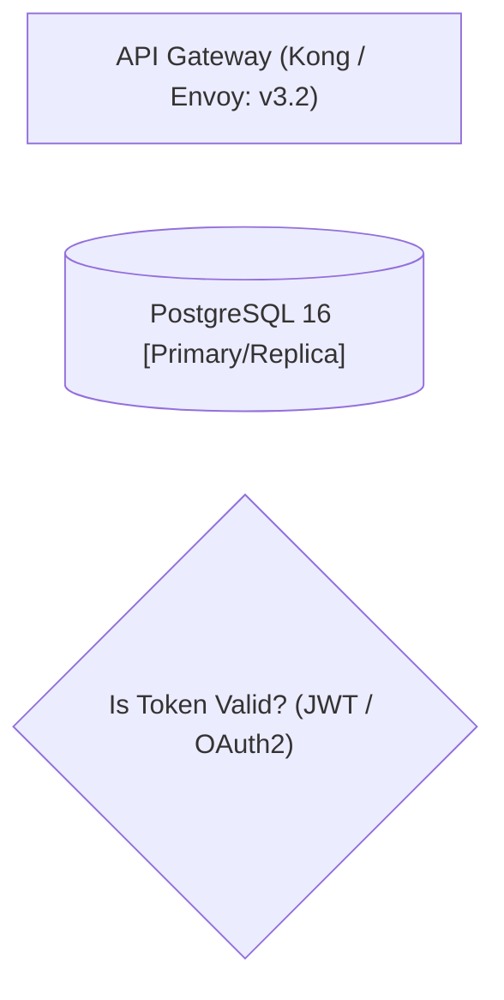
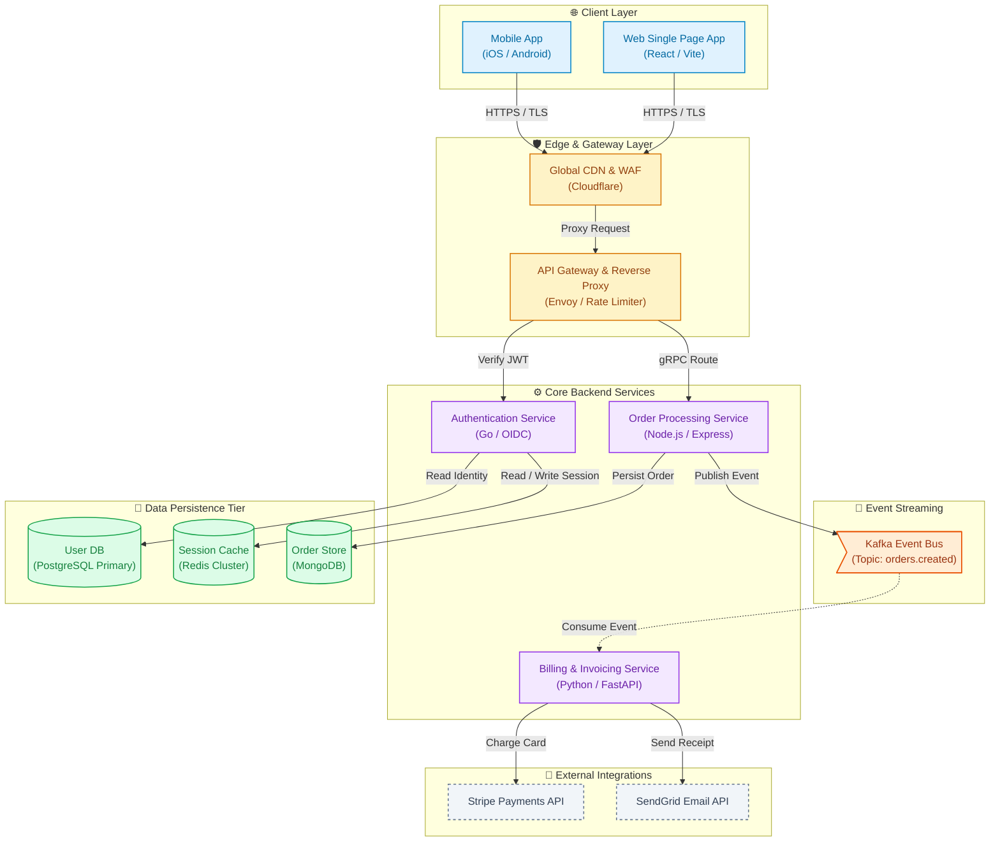
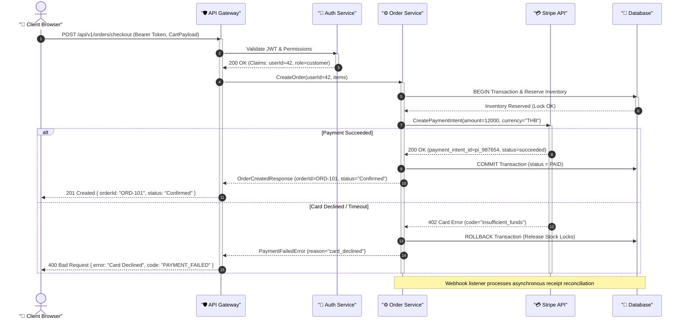
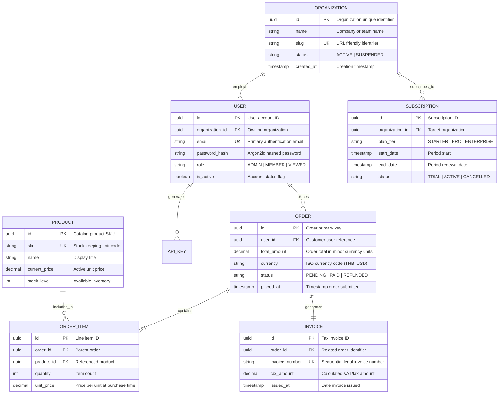
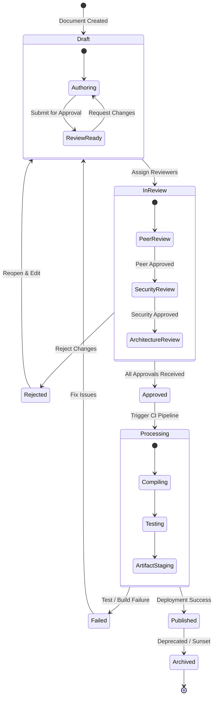
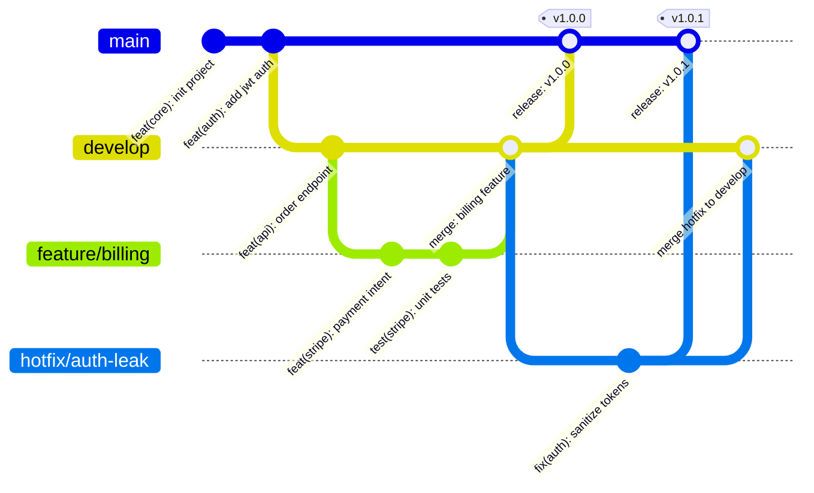
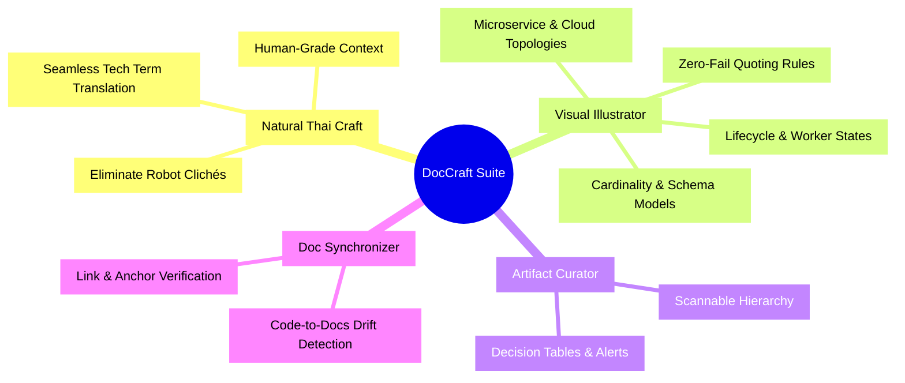

# Visual Illustrator: Robust Mermaid & Visual Diagram Generator

`visual-illustrator` is the authoritative guide and generator for technical diagrams in documentation, architectural RFCs, specifications, and executive artifacts. It ensures every visual diagram is syntactically resilient, visually balanced, immediately readable, and free from parser crashes.

---

## 1. Core Purpose & Philosophy

Visual diagrams must accelerate comprehension, not create cognitive burden. A good technical diagram communicates boundaries, protocols, lifecycles, and data relationships at a single glance.

### Principles
1. **Zero Render Failures**: Enforce strict syntax safety across all rendering engines (Mermaid.js CLI, GitHub Markdown, Notion, Obsidian, VS Code, and browser artifact previewers).
2. **Structural Clarity (Spaghetti-Free)**: Minimize criss-crossing edges, control layout flow deterministically, and establish natural visual hierarchies.
3. **Semantic Grouping**: Use clean subgraphs and boundary frames to isolate layers, services, security zones, and lifecycle stages.
4. **Professional Palette**: Use cohesive, accessible, soft enterprise colors with deliberate contrast—never raw neon or unreadable saturated accents.
5. **Comprehensiveness with Context**: Always pair diagrams with concise textual legends or narrative walk-throughs to provide end-to-end context.

---

## 2. High-Fidelity Typed Diagram Engine (Archify)

For complex, enterprise-grade architecture maps, workflows, sequences, data pipelines, and lifecycle diagrams delivered as standalone HTML artifacts, use the bundled **Archify Engine** located at `tools/archify/bin/archify.mjs`.

Archify uses a typed JSON Intermediate Representation (IR) to compile deterministic, responsive, zero-collision SVG diagrams with built-in dark/light themes, motion presets, semantic route probing, and 1200×630 share card exports.

### 5 Diagram Archetypes

| Type | Use For | Schema Path |
|---|---|---|
| `architecture` | Microservices, cloud boundaries, infrastructure, security zones | `tools/archify/schemas/architecture.schema.json` |
| `workflow` | CI/CD pipelines, approval gates, runbooks, tool call loops | `tools/archify/schemas/workflow.schema.json` |
| `sequence` | API request/response lifecycles, async message chains | `tools/archify/schemas/sequence.schema.json` |
| `dataflow` | ETL/ELT pipelines, streaming data lineage, governance | `tools/archify/schemas/dataflow.schema.json` |
| `lifecycle` | State machines, status transitions, retries, terminal states | `tools/archify/schemas/lifecycle.schema.json` |

### Authoring & Delivery Workflow

1. **Author Candidate Specification**:
   - Create `<diagram-name>.<type>.json` conforming to the archetype schema and `tools/archify/schemas/common.schema.json`.
   - Set `"quality_profile": "showcase"` in `meta` for pristine production standards.
   - Reference examples in `tools/archify/examples/` for structure and shape.

2. **Validate with Deterministic Quality Gates**:
   ```bash
   node tools/archify/bin/archify.mjs validate <type> <candidate.json> --quality showcase --json
   ```
   Ensures 0 composition errors, 0 collision warnings, and full 9 artifact checks passing.

3. **Deliver Atomic HTML Artifact**:
   ```bash
   node tools/archify/bin/archify.mjs deliver <type> <candidate.json> <output.html> --quality showcase --json
   ```

4. **Pre-flight Audit & SFTP Publish**:
   - Audit with `artifact-audit` to guarantee Thai `line-height >= 1.5` and Sarabun font injection.
   - Publish securely via `artifact_sftp.publish`.

---

## 3. Strict Syntax & Parsing Safety (The "Never Fail" Rules for Mermaid)

Mermaid parsers fail abruptly on unescaped symbols, malformed IDs, or deep subgraph recursion. Follow these non-negotiable rules for every generated diagram:

### Rule 1: Always Double-Quote Complex Node Labels
Any label containing spaces, parentheses `()`, brackets `[]`, braces `{}`, colons `:`, slashes `/`, hyphens `-`, quotes `"`, pipes `|`, or special characters **must** be enclosed in double quotes inside the shape delimiter.



```mermaid
%% INCORRECT - Unquoted punctuation triggers parser crashes
%% flowchart LR
%%     apiGateway[API Gateway (Kong: v3.2)]  <-- Syntax Error
```

### Rule 2: Safe Alphanumeric Node Identifiers
Use clean, descriptive `camelCase` or `snake_case` IDs containing only alphanumeric characters and underscores. Never use spaces, hyphens, numbers as initial characters, or special symbols in node IDs.

- **Safe**: `authService`, `db_postgres_primary`, `kafkaEventBus`, `clientApp`
- **Dangerous**: `auth-service`, `123_db`, `auth service`, `client.app`

### Rule 3: Avoid Raw HTML Inside Labels
Do not inject raw HTML tags (`<br>`, `<b>`, `<span>`, `<div>`, `<font>`) inside labels unless specifically targeting an environment with strict HTML trust enabled.
- For line breaks, use Mermaid's native string line break: `\n` inside double quotes.
- Example: `serviceA["Core Order Service\n(Port: 8080 | Go 1.22)"]`

### Rule 4: Explicit Orientation Declaration
Always declare diagram orientation explicitly at the top.
- `flowchart TD` (Top to Bottom): Ideal for multi-tiered systems, hierarchies, decision trees, and sequential workflows.
- `flowchart LR` (Left to Right): Ideal for data pipelines, microservice request chains, and end-to-end user journeys.

### Rule 5: Subgraph Nesting Safety (Max 2 Levels)
Limit nested subgraphs to a maximum of 2 levels (`Outer Zone` -> `Inner Cluster`). Deeply nested subgraphs cause layout calculation thrashing and overlapping node boxes.
- Always provide an explicit identifier and quoted title: `subgraph cluster_id ["Display Title"]`
- Always close every opened subgraph with an explicit `end`.

### Rule 6: Escape Reserved Keywords
Words such as `end`, `subgraph`, `state`, `class`, `style`, `graph`, `default`, `click` are reserved. If these words appear in titles or labels, wrap them in double quotes.

---

## Diagram Layout Ergonomics & Responsive Delivery

This section is mandatory for rich diagrams in published HTML artifacts. It is
the **Option 4 (Static Sanitized Inline SVG Delivery)** contract and does not
replace the Mermaid rules below for inline chat or pure Markdown.

### Rule: 100% Fit-First Responsive Container

The primary overview MUST fit the available container at every viewport width.
Use `max-width: 100%` and `overflow: hidden` on the diagram card. Strictly NO
horizontal scroll is allowed on the primary overview. Pan or scroll belongs only
inside the detail viewport after the reader activates the lightbox.

```css
.diagram-card {
  max-width: 100%;
  overflow: hidden;
}

.diagram-card > svg {
  display: block;
  width: 100%;
  height: auto;
  max-width: 100%;
  max-height: 480px;
}
```

### Rule: Semantic Responsive Inline SVG

For published HTML artifacts, produce a clean, semantic, responsive inline SVG
with all important meaning available to assistive technology:

- `viewBox="0 W H"` MUST define the coordinate system;
- `preserveAspectRatio="xMidYMid meet"` MUST preserve the whole overview;
- `width="100%"`, `height="auto"`, and `max-height: 480px` MUST be present;
- include `<title>` and `<desc>` when the diagram conveys more than decoration;
- keep the SVG inline and self-contained; do not load a renderer, font, image,
  stylesheet, or other asset from a remote URL.

### Rule: Namespaced Element IDs & Security Sanitization

Every gradient, marker, and clip must have a unique per-diagram ID such as
`diag-auth-grad1`, `diag-auth-marker1`, or `diag-auth-clip1`. IDs must not
collide with another diagram in the complete HTML document. Local references
such as `url(#diag-auth-grad1)` are allowed; external `url()` references are
not.

Never put `<script>`, `<foreignObject>`, `javascript:` URLs, external assets,
or inline `on*` event-handler attributes such as `onclick` or `onload` inside an
inline SVG. The lightbox JavaScript belongs in the surrounding HTML component
and must never be embedded inside the SVG node.

### Rule: Zero-Collision Geometry & Routing (Anti-Overlap Invariants)

To ensure diagrams remain crisp, legible, and completely free of overlapping lines or text collisions:

1. **Mandatory Text Pill Badges:**
   - Every text label along a connection path (`<text>`) MUST be wrapped in a `<g>` with a background `<rect>` badge (e.g. `<rect fill="#0b1120" stroke="#334155" rx="3" .../>`) positioned directly behind the text.
   - Text elements must never sit bare over path lines where lines slice through glyphs.

2. **Orthogonal Channel Routing (Manhattan Routing):**
   - Routing paths must use 90-degree step angles (`M ... L ... L ...`) rather than diagonal cuts crossing through foreign nodes.
   - Parallel paths sharing the same corridor MUST maintain a minimum of **20px dedicated Y-axis or X-axis clearance** (no collinear line overlap).

3. **Node Bounding Box Safety Clearance:**
   - Maintain minimum horizontal gap $\ge 60\text{px}$ and vertical gap $\ge 40\text{px}$ between adjacent node rectangles.
   - Node bounding boxes must never intersect or touch.

4. **Port Isolation on Nodes:**
   - Incoming and outgoing arrows must connect to distinct anchor points (ports) on a node rather than colliding into a single point.

5. **Thai Typography & Multiline Line-Height in SVG (`line-height >= 1.5`):**
   - In Thai script, stacked vowels (สระบน `ิ, ี, ึ, ื`), tone marks (วรรณยุกต์ `่, ้, ๊, ๋`, `็`, `์`), and below-vowels (สระล่าง `ุ, ู`) require strict vertical clearance.
   - For multiline SVG `<text>` using `<tspan x="..." dy="...">`, the vertical step `dy` MUST be **$\ge 1.5\text{em}$ or $\ge 1.5 \times \text{font-size}$** (e.g. for 12px font, `dy >= 18px`; for 14px font, `dy >= 21px`). Never use tight line-heights ($< 1.5$) which cause direct collisions between lower vowels of line $N$ and upper vowels/tone marks of line $N+1$.
   - Node bounding box height for Thai text must be at least $\ge 44\text{px}$ for single-line, and $+20\text{px}$ per additional line to prevent top/bottom tone marks from being clipped by node boundary borders.
   - Label pill `<rect>` height must be $\ge 1.6 \times \text{font-size}$ centered vertically around the text.

---

### Rule: Viewport Lightbox Component (`<dialog>`) — Standard Pan & Zoom Engine

Use this copy-pasteable, bulletproof Tier A component for deep-dive inspection. It enforces:
1. **100% Borderless Fullscreen Canvas:** `<dialog>` is `100vw × 100vh` Zen canvas without margin/border/footer waste.
2. **Two-Tier Canvas Architecture:** Outer `.lightbox-viewport` (`cursor: grab; overflow: hidden;`) + Inner `.lightbox-canvas` (`position: absolute; will-change: transform;`).
3. **True Transform Matrix:** Uses `transform: translate(${translateX}px, ${translateY}px) scale(${scale})` on canvas (never `scale()` alone).
4. **Triple-Mode Interaction:** Mouse Drag to Pan (`grabbing`), Cursor-centered Wheel Zoom, and Mobile Touch Panning.
5. **Integrated Header Toolbar:** `➕`, `➖`, `↺`, Scale Badge (`สเกล: 100%`), and `✕ ปิด (Esc)`.
6. **Single-Node Transfer & Focus Restoration:** Transfers SVG node to preserve unique IDs and restores focus to the trigger on close.

```html
<style>
  .diagram-card {
    max-width: 100%;
    overflow: hidden;
  }

  .diagram-card > svg {
    display: block;
    width: 100%;
    height: auto;
    max-width: 100%;
    max-height: 480px;
  }

  /* 100% BORDERLESS FULLSCREEN ZEN LIGHTBOX */
  .diagram-lightbox {
    position: fixed;
    inset: 0;
    width: 100vw;
    height: 100vh;
    max-width: 100vw;
    max-height: 100vh;
    margin: 0;
    padding: 0;
    border: 0;
    border-radius: 0;
    background: #060911;
    display: flex;
    flex-direction: column;
    overflow: hidden;
    color: #e2e8f0;
  }

  .diagram-lightbox::backdrop {
    background: rgb(3 7 18 / 90%);
  }

  .diagram-lightbox__header {
    display: flex;
    justify-content: space-between;
    align-items: center;
    padding: 0.65rem 1.25rem;
    background: #101726;
    border-bottom: 1px solid #24324f;
    flex-shrink: 0;
    gap: 1rem;
  }

  .diagram-lightbox__header h2 {
    margin: 0;
    font-size: 1rem;
    font-weight: 600;
    color: #f8fafc;
    white-space: nowrap;
    overflow: hidden;
    text-overflow: ellipsis;
  }

  .lightbox-controls {
    display: flex;
    align-items: center;
    gap: 0.5rem;
  }

  .toolbar-btn {
    background: #1e293b;
    color: #f1f5f9;
    border: 1px solid #334155;
    padding: 0.35rem 0.75rem;
    border-radius: 6px;
    font-size: 0.85rem;
    cursor: pointer;
    display: inline-flex;
    align-items: center;
    justify-content: center;
    transition: background 0.15s, border-color 0.15s;
  }

  .toolbar-btn:hover {
    background: #334155;
    border-color: #64748b;
  }

  .scale-badge {
    font-size: 0.8rem;
    padding: 0.35rem 0.6rem;
    background: #0f172a;
    border: 1px solid #334155;
    border-radius: 6px;
    color: #94a3b8;
    min-width: 80px;
    text-align: center;
  }

  /* TWO-TIER PAN & ZOOM VIEWPORT/CANVAS */
  .lightbox-viewport {
    flex: 1;
    width: 100%;
    height: 100%;
    position: relative;
    overflow: hidden;
    cursor: grab;
    display: flex;
    align-items: center;
    justify-content: center;
    background: #060911;
  }

  .lightbox-viewport:active {
    cursor: grabbing;
  }

  .lightbox-canvas {
    position: absolute;
    transform-origin: center center;
    will-change: transform;
    transition: transform 0.05s ease-out;
    display: flex;
    align-items: center;
    justify-content: center;
    width: 100%;
    max-width: 1200px;
  }

  .lightbox-canvas > svg {
    display: block;
    width: 100%;
    height: auto;
  }
</style>

<!-- DIAGRAM CARD -->
<figure class="diagram-card" id="diag-auth-card">
  <svg id="diag-auth-svg"
       viewBox="0 0 800 420"
       preserveAspectRatio="xMidYMid meet"
       width="100%"
       height="auto"
       role="img"
       aria-labelledby="diag-auth-title diag-auth-desc">
    <title id="diag-auth-title">Authentication request flow</title>
    <desc id="diag-auth-desc">The client reaches the gateway, which validates a token before the service reads the account store.</desc>
    <defs>
      <linearGradient id="diag-auth-grad1" x1="0" y1="0" x2="1" y2="1">
        <stop offset="0" stop-color="#e0f2fe" />
        <stop offset="1" stop-color="#f3e8ff" />
      </linearGradient>
      <marker id="diag-auth-marker1" markerWidth="8" markerHeight="8" refX="7" refY="4" orient="auto">
        <path d="M0 0L8 4L0 8Z" fill="#334155" />
      </marker>
      <clipPath id="diag-auth-clip1">
        <rect x="24" y="24" width="752" height="372" rx="16" />
      </clipPath>
    </defs>
    <rect x="24" y="24" width="752" height="372" rx="16" fill="url(#diag-auth-grad1)" clip-path="url(#diag-auth-clip1)" />
    <g fill="#ffffff" stroke="#334155" stroke-width="2">
      <rect x="72" y="170" width="160" height="72" rx="12" />
      <rect x="320" y="170" width="160" height="72" rx="12" />
      <rect x="568" y="170" width="160" height="72" rx="12" />
    </g>
    <g fill="#0f172a" font-family="Sarabun, sans-serif" font-size="20" text-anchor="middle">
      <text x="152" y="214">Client</text>
      <text x="400" y="214">Gateway</text>
      <text x="648" y="214">Account Store</text>
    </g>
    <g stroke="#334155" stroke-width="3" fill="none" marker-end="url(#diag-auth-marker1)">
      <path d="M232 206H320" />
      <path d="M480 206H568" />
    </g>
  </svg>
  <figcaption>Token validation and account lookup</figcaption>
  <button type="button"
          id="diag-auth-open"
          class="toolbar-btn"
          aria-controls="diag-auth-dialog">
    🔍 ขยายดูรายละเอียด (Expand / View Detail)
  </button>
</figure>

<!-- VIEWPORT LIGHTBOX -->
<dialog class="diagram-lightbox"
        id="diag-auth-dialog"
        aria-labelledby="diag-auth-dialog-title">
  <div class="diagram-lightbox__header">
    <h2 id="diag-auth-dialog-title">Authentication request flow</h2>
    <div class="lightbox-controls" role="group" aria-label="Diagram zoom controls">
      <button type="button" id="diag-auth-zoom-in" class="toolbar-btn" aria-label="Zoom In">➕ ขยาย</button>
      <button type="button" id="diag-auth-zoom-out" class="toolbar-btn" aria-label="Zoom Out">➖ ย่อ</button>
      <button type="button" id="diag-auth-zoom-reset" class="toolbar-btn" aria-label="Reset">↺ รีเซ็ต</button>
      <span id="diag-auth-scale-badge" class="scale-badge">สเกล: 100%</span>
      <button type="button" id="diag-auth-close" class="toolbar-btn" style="background:#dc2626;border-color:#ef4444;">✕ ปิด (Esc)</button>
    </div>
  </div>
  <div class="lightbox-viewport" id="diag-auth-viewport">
    <div class="lightbox-canvas" id="diag-auth-canvas"></div>
  </div>
</dialog>

<!-- JAVASCRIPT: BULLETPROOF PAN & ZOOM CANVAS ENGINE -->
<script>
(() => {
  const card = document.querySelector("#diag-auth-card");
  const sourceSvg = card.querySelector("svg");
  const trigger = card.querySelector("#diag-auth-open");
  const dialog = document.querySelector("#diag-auth-dialog");
  const viewport = dialog.querySelector("#diag-auth-viewport");
  const canvas = dialog.querySelector("#diag-auth-canvas");
  const closeButton = dialog.querySelector("#diag-auth-close");
  const btnZoomIn = dialog.querySelector("#diag-auth-zoom-in");
  const btnZoomOut = dialog.querySelector("#diag-auth-zoom-out");
  const btnZoomReset = dialog.querySelector("#diag-auth-zoom-reset");
  const scaleBadge = dialog.querySelector("#diag-auth-scale-badge");
  const placeholder = document.createComment("diagram source position");

  let scale = 1.0;
  let translateX = 0;
  let translateY = 0;
  let isDragging = false;
  let startX = 0;
  let startY = 0;

  function applyTransform() {
    canvas.style.transform = `translate(${translateX}px, ${translateY}px) scale(${scale})`;
    if (scaleBadge) scaleBadge.textContent = `สเกล: ${Math.round(scale * 100)}%`;
  }

  function resetTransform() {
    scale = 1.0;
    translateX = 0;
    translateY = 0;
    applyTransform();
  }

  function zoom(delta, clientX, clientY) {
    const oldScale = scale;
    let newScale = Math.min(Math.max(0.5, scale + delta), 4.0);
    if (newScale === oldScale) return;

    if (clientX !== undefined && clientY !== undefined) {
      const rect = viewport.getBoundingClientRect();
      const originX = clientX - (rect.left + rect.width / 2);
      const originY = clientY - (rect.top + rect.height / 2);
      translateX -= (originX / oldScale) * (newScale - oldScale);
      translateY -= (originY / oldScale) * (newScale - oldScale);
    }

    scale = newScale;
    applyTransform();
  }

  function openModal() {
    sourceSvg.replaceWith(placeholder);
    canvas.replaceChildren(sourceSvg);
    sourceSvg.style.width = "100%";
    sourceSvg.style.maxWidth = "1200px";
    sourceSvg.style.height = "auto";
    sourceSvg.style.maxHeight = "none";

    resetTransform();
    if (typeof dialog.showModal === "function") {
      dialog.showModal();
    } else {
      dialog.setAttribute("open", "");
    }
    closeButton.focus();
  }

  function closeModal() {
    if (typeof dialog.close === "function" && dialog.open) {
      dialog.close();
    } else {
      dialog.removeAttribute("open");
      restoreSource();
    }
  }

  function restoreSource() {
    if (placeholder.parentNode) placeholder.replaceWith(sourceSvg);
    sourceSvg.style.width = "";
    sourceSvg.style.maxWidth = "";
    sourceSvg.style.height = "";
    sourceSvg.style.maxHeight = "";
    canvas.replaceChildren();
    resetTransform();
    trigger.focus();
  }

  trigger.addEventListener("click", openModal);
  closeButton.addEventListener("click", closeModal);
  dialog.addEventListener("cancel", (e) => {
    e.preventDefault();
    closeModal();
  });
  dialog.addEventListener("close", restoreSource);

  // Backdrop click close
  dialog.addEventListener("click", (e) => {
    const rect = dialog.getBoundingClientRect();
    const isInDialog = (rect.top <= e.clientY && e.clientY <= rect.top + rect.height &&
      rect.left <= e.clientX && e.clientX <= rect.left + rect.width);
    if (!isInDialog) closeModal();
  });

  // Zoom Button Controls
  btnZoomIn.addEventListener("click", () => zoom(0.25));
  btnZoomOut.addEventListener("click", () => zoom(-0.25));
  btnZoomReset.addEventListener("click", resetTransform);

  // Mouse Wheel Zoom centered at cursor
  viewport.addEventListener("wheel", (e) => {
    e.preventDefault();
    const delta = e.deltaY < 0 ? 0.15 : -0.15;
    zoom(delta, e.clientX, e.clientY);
  }, { passive: false });

  // Mouse Drag to Pan
  viewport.addEventListener("mousedown", (e) => {
    if (e.target.closest(".toolbar-btn")) return;
    isDragging = true;
    startX = e.clientX - translateX;
    startY = e.clientY - translateY;
    viewport.style.cursor = "grabbing";
  });

  window.addEventListener("mousemove", (e) => {
    if (!isDragging) return;
    translateX = e.clientX - startX;
    translateY = e.clientY - startY;
    applyTransform();
  });

  window.addEventListener("mouseup", () => {
    if (isDragging) {
      isDragging = false;
      viewport.style.cursor = "grab";
    }
  });

  // Mobile Touch Panning
  viewport.addEventListener("touchstart", (e) => {
    if (e.touches.length === 1) {
      isDragging = true;
      startX = e.touches[0].clientX - translateX;
      startY = e.touches[0].clientY - translateY;
    }
  }, { passive: true });

  viewport.addEventListener("touchmove", (e) => {
    if (!isDragging || e.touches.length !== 1) return;
    translateX = e.touches[0].clientX - startX;
    translateY = e.touches[0].clientY - startY;
    applyTransform();
  }, { passive: true });

  viewport.addEventListener("touchend", () => {
    isDragging = false;
  });
})();
</script>
```

If native `<dialog>` is unavailable, use the RFC's Tier B iframe viewport or
Tier C no-JavaScript sanitized static fit. Neither fallback may reintroduce
horizontal scrolling in the primary overview.

---

## 3. Core Diagram Archetypes & Production Templates

### Archetype 1: Architecture & System Component Flow (`flowchart`)
Used for microservice architectures, cloud infrastructure, network topology, and event-driven backends.



---

### Archetype 2: Sequence Diagrams (`sequenceDiagram`)
Used for API authentication flows, distributed transactions, checkout sequences, and webhook lifecycles.



---

### Archetype 3: Database Entity Relationship Diagrams (`erDiagram`)
Used for database schemas, relational modeling, entity cardinalities, and domain boundary mappings.

#### Cardinality Guide:
- `||--||` : Exactly 1 to Exactly 1
- `||--o{` : Exactly 1 to 0 or more (One-to-Many optional)
- `||--|{` : Exactly 1 to 1 or more (One-to-Many mandatory)
- `}|--o{` : Many to Many (via junction table recommended)



---

### Archetype 4: State Diagrams (`stateDiagram-v2`)
Used for state machines, background job workers, order fulfillment, deployment stages, and ticket workflows.



---

### Archetype 5: Git / Release Lifecycle & Project Mindmaps

#### Git Workflow & Release Branching (`gitGraph`)


#### Strategic Product Mindmap (`mindmap`)


---

## 4. Visual Ergonomics & Aesthetic Styling

### Anti-Spaghetti Rules (Preventing Tangled Lines)
1. **Linear Ordering**: Place components in the natural direction of data flow (e.g., in `TD`, define Clients at the top, Gateway next, Services middle, Storage bottom).
2. **Subgraphs as Guardrails**: Enclose related components inside named subgraphs. This forces the layout engine to group nodes and prevents long criss-crossing vectors.
3. **Decouple Asynchronous Paths**: Use dashed lines `-.->` or event buses/queues rather than direct point-to-point links across distant layers.
4. **Split Oversized Diagrams**: If a single diagram exceeds 15 nodes with multiple cross-connections, split it into:
   - Level 1: System Context Diagram (Broad boundaries)
   - Level 2: Component Deep-Dive Diagram (Specific subsystem flow)

### Enterprise Palette Standard (`classDef`)
Avoid default neon greens or high-saturation purples. Apply soft pastel fills with deep, legible borders and contrasting text:

| Style Class | Fill Hex | Stroke Hex | Text Hex | Use Case |
| :--- | :--- | :--- | :--- | :--- |
| `primary` | `#e0f2fe` | `#0284c7` | `#0369a1` | Frontend, user-facing layers, primary actors |
| `service` | `#f3e8ff` | `#9333ea` | `#6b21a8` | Internal microservices, worker processes |
| `gateway` | `#fef3c7` | `#d97706` | `#92400e` | Ingress proxies, load balancers, firewalls |
| `storage` | `#dcfce7` | `#16a34a` | `#15803d` | Relational DBs, caches, object storage |
| `queue` | `#ffedd5` | `#ea580c` | `#9a3412` | Message queues, Kafka, RabbitMQ, Redis Pub/Sub |
| `danger` | `#fee2e2` | `#dc2626` | `#991b1b` | Error fallbacks, dead-letter queues, unauthorized |
| `external`| `#f1f5f9` | `#64748b` | `#334155` | 3rd-party SaaS, external vendors, payment APIs |

#### Code Definition Snippet:
```mermaid
classDef primary fill:#e0f2fe,stroke:#0284c7,stroke-width:1.5px,color:#0369a1;
classDef service fill:#f3e8ff,stroke:#9333ea,stroke-width:1.5px,color:#6b21a8;
classDef gateway fill:#fef3c7,stroke:#d97706,stroke-width:1.5px,color:#92400e;
classDef storage fill:#dcfce7,stroke:#16a34a,stroke-width:1.5px,color:#15803d;
classDef queue fill:#ffedd5,stroke:#ea580c,stroke-width:1.5px,color:#9a3412;
classDef danger fill:#fee2e2,stroke:#dc2626,stroke-width:1.5px,color:#991b1b;
classDef external fill:#f1f5f9,stroke:#64748b,stroke-width:1.5px,color:#334155,stroke-dasharray: 4 4;
```

---

## 5. Markdown Artifact & Document Integration

When incorporating Mermaid diagrams into technical specs, RFCs, and markdown artifacts:

1. **Fenced Code Block**: Always use ` ```mermaid ` with no trailing characters.
2. **Contextual Lead-in**: Introduce the diagram with a 1-2 sentence orientation explaining what the reader is examining.
3. **Narrative Legend / Callout Table**: Follow the diagram with a structured summary or table highlighting critical components, protocols, and security boundaries.

### Example Integration Pattern:

```markdown
### 3.2 Authentication & Token Exchange Architecture

The following diagram illustrates the mutual TLS handshake and OAuth2 token exchange between the Mobile Client, API Gateway, and Identity Provider.

```mermaid
flowchart LR
    client["Mobile App"] -->|"1. /oauth/token"| gw["Edge Gateway"]
    gw -->|"2. Validate Client ID"| idp["OAuth 2.0 IdP"]
    idp -->>|"3. Issue JWT & Refresh Token"| gw
    gw -->>|"4. Set Secure Cookie"| client
```

**Key Architectural Invariants**:
- **Zero Raw Tokens in Storage**: Access tokens are held exclusively in memory; refresh tokens reside in `HttpOnly, Secure` cookies.
- **Clock Skew Tolerance**: The Gateway enforces a 60-second grace period on JWT expiration claims (`exp`).
```

---

## 6. Comprehensive Troubleshooting & Self-Correction Guide

When a Mermaid diagram fails to render or throws a syntax error, apply this systematic diagnosis checklist:

| Error Symptom | Common Root Cause | Immediate Fix |
| :--- | :--- | :--- |
| `Parse error on line X` | Unquoted special characters: `()`, `[]`, `{}`, `:`, `/`, `-` in node labels | Wrap the entire label string in double quotes: `node["Text (with chars): value"]` |
| `No such diagram type` | Typo in diagram header (e.g. `flowChart`, `sequencediagram`) | Ensure exact case: `flowchart TD`, `sequenceDiagram`, `erDiagram`, `stateDiagram-v2` |
| Subgraph layout mangled or missing | Missing `end` keyword or nested beyond 2 levels | Verify each `subgraph` has a matching `end`. Flatten deep nesting. |
| Sequence diagram arrows broken | Using flowchart arrows (`-->`) instead of sequence arrows (`->>`, `-->>`) | Replace with sequence notation: `A->>B: Sync Call`, `B-->>A: Return Value` |
| ERD attribute syntax error | Commas between attributes or missing data types | Remove commas between entity fields; specify type before name (`string name`, `uuid id PK`) |
| Unrendered raw HTML tags | Using `<br>` or `<b>` in strict markdown renderers | Replace `<br>` with `\n` inside double-quoted string. Remove formatting tags from labels. |
| Node overlapping / crossing lines | Graph orientation conflict or excessive direct links | Switch orientation (`TD` to `LR` or vice versa); group nodes into subgraphs. |

### Fallback Strategy
If an environment strictly restricts Mermaid execution or if the data model has high dimensional density (e.g., matrix with >20 columns), fall back to structured GitHub Flavored Markdown Tables accompanied by ASCII branch trees.
